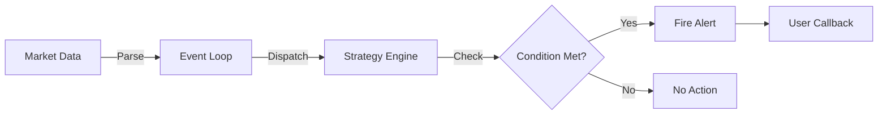
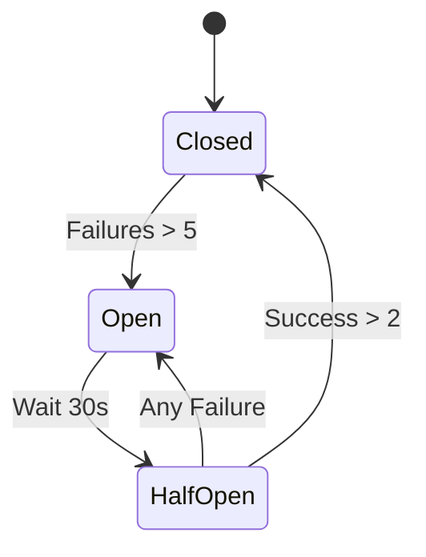
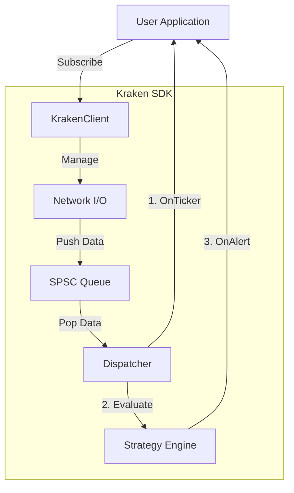
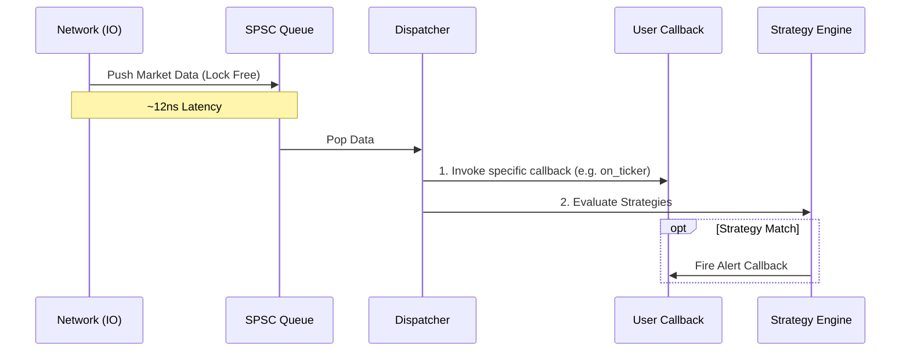

# Kraken WebSocket SDK

**A Production-Grade Enterprise C++ SDK for Real-Time Market Data Streaming**

[](https://en.cppreference.com/w/cpp/17)
[](https://cmake.org/)
[](LICENSE)
[](https://github.com/kgsahil/kraken-sdk/actions)

A high-performance, enterprise-ready C++ SDK for streaming real-time market data from Kraken Exchange. Built with production-grade architecture, comprehensive testing, and extensive monitoring capabilities.

---

## 🚀 Quick Start

```cpp
#include <kraken/kraken.hpp>

int main() {
    kraken::KrakenClient client;
    
    client.on_ticker([](const kraken::Ticker& t) {
        std::cout << t.symbol << ": $" << t.last << std::endl;
    });
    
    client.subscribe(kraken::Channel::Ticker, {"BTC/USD", "ETH/USD"});
    client.run();
}
```
## 🏆 Key Highlights

- **🎯 Trading Strategy Engine** - Built-in intelligence with composition, presets, and runtime control
- **⚡ High Performance** - Sub-microsecond latency, lock-free architecture, 88M+ ops/sec queue
- **📊 Enterprise Observability** - OpenTelemetry, Prometheus, structured logging
- **🔒 Production-Grade Reliability** - CRC32 validation, gap detection, automatic reconnection
- **🧪 Comprehensive Testing** - 25 test suites, 328 test cases, 100% pass rate
- **📚 Extensive Documentation** - Doxygen API docs, guides, examples, configuration reference

---

## ✨ Enterprise Features

### 🎯 **Trading Strategy Engine** (Unique Differentiator)
Built-in intelligent alert system that monitors market conditions in real-time:




```cpp
// Price threshold alert
auto alert = kraken::PriceAlert::Builder()
    .symbol("BTC/USD")
    .above(100000.0)
    .build();

client.add_alert(alert, [](const kraken::Alert& a) {
    std::cout << "🚨 Alert: " << a.message << std::endl;
});
```

**Available Strategies:**
- `PriceAlert` - Threshold-based price monitoring (recurring, cooldown support)
- `VolumeSpike` - Unusual volume detection (N× average)
- `SpreadAlert` - Spread monitoring and alerts
- `CompositeStrategy` - Combine strategies with AND/OR logic
- `StrategyPresets` - Ready-to-use patterns (breakout, support/resistance)
- **Multi-Data Source** - Strategies can monitor Ticker, OrderBook, Trade, and OHLC data
- **Configuration Support** - Create strategies from config files/env vars via `StrategyConfig`
- **Runtime Control** - Enable/disable strategies dynamically without removal
- **Extensible** - Custom strategies via `AlertStrategy` base class

📖 **Learn more:** [Strategy Engine Guide](docs/STRATEGY_ENGINE.md)

### 🔒 **Data Integrity & Reliability**
- **CRC32 Checksum Validation** - Detects corrupted order book data
- **Message Gap Detection** - Tracks sequence numbers to identify missed messages
- **Automatic Reconnection** - Exponential backoff with jitter (production-ready)
- **Circuit Breaker** - Prevents cascading failures by automatically opening circuit after repeated connection failures
- **Resubscription** - Automatically restores subscriptions after reconnection
- **Outbound Rate Limiter** - Token-bucket throttling of all outbound messages (configurable RPS + burst)

```cpp
client.on_book([](const std::string& symbol, const kraken::OrderBook& book) {
    if (!book.is_valid) {
        std::cerr << "⚠️ Checksum mismatch - data integrity issue" << std::endl;
        return;
    }
    
    // Use validated data
    double imbalance = book.imbalance(10);
    std::cout << "Spread: $" << book.spread() << std::endl;
});
```

📖 **Learn more:** [Connection Configuration](docs/ENVIRONMENT_VARIABLES.md#connection-settings) | [Project Analysis](docs/PROJECT_ANALYSIS.md)

### ⚡ **High-Performance Architecture**
- **Optional Lock-Free SPSC Queue** - Zero-contention message passing (88M ops/sec) when enabled, or direct dispatch for minimal latency
- **Flexible Threading Model** - Two-thread reactor (with queue) or single-thread direct mode (without queue)
- **Atomic Metrics** - Lock-free performance counters
- **Zero-Copy JSON Parsing** - RapidJSON for minimal allocations
- **O(log n) Order Book Updates** - `std::map` for efficient price level management

📖 **Learn more:** [Performance Benchmarks](#-performance-benchmarks) | [Architecture Analysis](docs/PROJECT_ANALYSIS.md)

### 📊 **Enterprise Monitoring & Observability**
- **Dual Metrics System:**
  - **Local API** (`get_metrics()`) - Real-time in-process metrics
  - **OpenTelemetry + OTLP** - OTLP HTTP exporter and Prometheus endpoint (Jaeger/Grafana ready)
- **Structured Logging** - spdlog with levels, rotation, file/console output
- **Performance Dashboard** - Live terminal UI for real-time monitoring
- **Comprehensive Metrics:**
  - Message counts (received, processed, dropped)
  - Queue depth and latency
  - Connection state tracking
  - Gap detection statistics

📖 **Learn more:** [OpenTelemetry Integration](docs/OTEL_STATUS.md) | [Metrics Guide](docs/METRICS.md) | [Telemetry Configuration](docs/ENVIRONMENT_VARIABLES.md#telemetry-settings)

### 🔐 **Security & Authentication**
- **HMAC-SHA512 Authentication** - Secure API key/secret handling
- **Private Channel Support** - Access your own trades, open orders, and account balances
- **TLS/SSL Support** - Configurable certificate validation
- **Connection Timeouts** - Configurable timeouts for all operations
- **Security Configuration** - Custom CA certs, client certs, cipher suites

**Private Channels (Requires Authentication):**
```cpp
// Configure authentication
auto config = kraken::ClientConfig::Builder()
    .api_key("your-api-key")
    .api_secret("your-api-secret")
    .build();

kraken::KrakenClient client(config);

// Subscribe to your own trades
client.on_own_trade([](const kraken::OwnTrade& trade) {
    std::cout << "Trade executed: " << trade.symbol 
              << " @ $" << trade.price 
              << " (qty: " << trade.quantity << ")" << std::endl;
});
client.subscribe_own_trades();

// Subscribe to open orders
client.on_order([](const kraken::Order& order) {
    std::cout << "Order: " << order.symbol 
              << " " << (order.side == kraken::Side::Buy ? "BUY" : "SELL")
              << " " << order.quantity << " @ $" << order.price
              << " (filled: " << order.fill_percentage() << "%)" << std::endl;
});
client.subscribe_open_orders();

// Subscribe to account balances
client.on_balance([](const std::unordered_map<std::string, kraken::Balance>& balances) {
    for (const auto& [currency, balance] : balances) {
        std::cout << currency << ": " << balance.available 
                  << " available, " << balance.reserved << " reserved" << std::endl;
    }
});
client.subscribe_balances();
```

📖 **Learn more:** [Connection Configuration](docs/ENVIRONMENT_VARIABLES.md#connection-settings) | [Security Settings](docs/ENVIRONMENT_VARIABLES.md#security-settings)

### 🛠️ **Production-Ready Design**
- **PIMPL Pattern** - ABI stability, hide implementation dependencies
- **Builder Pattern** - Fluent, self-documenting configuration
- **RAII** - Automatic resource management, exception-safe
- **Thread-Safe API** - Safe concurrent access to callbacks, subscriptions, metrics
- **Comprehensive Error Handling** - Exceptions for setup, callbacks for runtime

**Circuit Breaker Logic:**


📖 **Learn more:** [Project Analysis / Architecture](docs/PROJECT_ANALYSIS.md)

### 📦 **Developer Experience**
- **Environment Variable Configuration** - Deploy without code changes
- **Config File Support** - Load settings from `.cfg` files
- **JSON Serialization** - All data types serialize for web integration
- **Analytics Helpers** - Built-in spread, imbalance, liquidity calculations
- **9 Practical Examples** - From quickstart to trading bots

📖 **Learn more:** [Environment Variables Guide](docs/ENVIRONMENT_VARIABLES.md) | [Configuration Guide](docs/CONFIGURATION_ROADMAP.md) | [Examples](examples/README.md)

---

## 🏗️ Architecture

### System Components



### High-Performance Data Path



**Architecture Modes:**
- **Queue Mode (Default)**: I/O thread → SPSC Queue → Dispatcher thread → Callbacks (I/O never blocks callbacks)
- **Direct Mode**: I/O thread → Callbacks directly (minimal latency, single-threaded)

### Design Patterns

| Pattern | Purpose | Benefit |
|---------|---------|---------|
| **PIMPL** | Hide implementation | ABI stability, faster compilation |
| **Builder** | Fluent configuration | Self-documenting, type-safe |
| **Strategy** | Extensible alerts | Custom trading strategies |
| **Reactor** | Two-thread architecture | I/O never blocks callbacks |
| **RAII** | Resource management | Exception-safe, no leaks |

### Implementation Highlights

| Component | Technology | Why |
|-----------|------------|-----|
| WebSocket | Boost.Beast | Industry-standard, TLS support |
| JSON Parsing | RapidJSON | Zero-copy, fastest C++ JSON parser |
| Message Queue | rigtorp/SPSCQueue | Lock-free, 88M ops/sec (optional) |
| Order Book | `std::map` | O(log n) updates, efficient |
| Metrics | `std::atomic` | Lock-free, zero contention |
| Threading | `std::condition_variable` | Efficient wake-up, no spin-wait |
| Architecture | Modular (core/strategies/telemetry/connection) | Clean separation, maintainable |

---

## 📈 Performance Benchmarks

All benchmarks run in Release mode with Google Benchmark:

| Operation | Latency | Throughput | Notes |
|-----------|---------|------------|-------|
| **JSON Parsing** | 1.5 - 2.2 μs | 320K+ msgs/sec | Zero-copy RapidJSON |
| **Queue Push/Pop** | 11 - 12 ns | 85M+ ops/sec | Lock-free SPSC queue (optional) |
| **Order Book Update** | 51 ns | 19M updates/sec | Single price level |
| **Checksum Calculation** | 24 μs | 41K checksums/sec | CRC32 validation |
| **End-to-End Latency** | < 1 ms | - | I/O → Queue → Callback |

📖 **Detailed Results:** [Performance Benchmarks](docs/BENCHMARKS.md) | [Test Results](docs/TEST_RESULTS.md)

---

## 🚀 Installation

### Requirements
- **C++17** compiler (GCC 9+, Clang 10+, MSVC 2019+)
- **CMake 3.16+**
- **Boost 1.70+** (system component)
- **OpenSSL 1.1.1+**

### Quick Build

```bash
# Ubuntu/WSL
sudo apt-get install -y build-essential cmake libssl-dev libboost-system-dev

git clone https://github.com/kgsahil/kraken-sdk.git
cd kraken-sdk
mkdir build && cd build
cmake .. -DCMAKE_BUILD_TYPE=Release
make -j$(nproc)
```

### Configuration Options

**1. Environment Variables** (Recommended for deployment):
```bash
export KRAKEN_API_KEY="your-api-key"
export KRAKEN_API_SECRET="your-api-secret"
export ENABLE_SPSC_QUEUE="true"  # Set to "false" for direct mode (single-threaded)
export SPSC_QUEUE_SIZE="131072"  # Only used if ENABLE_SPSC_QUEUE="true"
export WS_CONN_RETRY_DELAY_MS="1000"
export WS_CONN_RETRY_MULTIPLIER="2.0"
export WS_CONN_RETRY_TIMES="10"
export CIRCUIT_BREAKER_ENABLED="true"
export CIRCUIT_BREAKER_FAILURE_THRESHOLD="5"
export CIRCUIT_BREAKER_SUCCESS_THRESHOLD="2"
export CIRCUIT_BREAKER_OPEN_TIMEOUT_SEC="30"
export CIRCUIT_BREAKER_HALF_OPEN_TIMEOUT_SEC="5"
export ENABLE_TELEMETRY="true"
export TELEMETRY_HTTP_SERVER="true"
export TELEMETRY_HTTP_PORT="9090"

# Use in code
auto config = kraken::config_from_env();
kraken::KrakenClient client(config);
```

**2. Config File** (For examples):
```bash
# Create config.cfg
cat > config.cfg << EOF
KRAKEN_API_KEY=your-key
KRAKEN_API_SECRET=your-secret
ENABLE_SPSC_QUEUE=true
SPSC_QUEUE_SIZE=131072
EOF

# Run with config
./dashboard --config=config.cfg
```

**3. Builder Pattern** (For programmatic configuration):
```cpp
auto config = kraken::ClientConfig::Builder()
    .url("wss://ws.kraken.com/v2")
    .api_key("your-key")
    .api_secret("your-secret")
    .use_queue(true)  // Set to false for direct mode (single-threaded, minimal latency)
    .queue_capacity(131072)  // Only used if use_queue() is true
    .validate_checksums(true)
    .backoff(kraken::ExponentialBackoff::Builder()
        .initial_delay(std::chrono::milliseconds(100))
        .max_delay(std::chrono::seconds(30))
        .max_attempts(20)
        .jitter_factor(0.2)
        .build())
    .circuit_breaker(true, 5, 2,  // enabled, failure_threshold=5, success_threshold=2
                     std::chrono::seconds(30),  // open_state_timeout
                     std::chrono::seconds(5))   // half_open_timeout
    .gap_detection(true)
    .on_gap([](const kraken::GapInfo& gap) {
        std::cerr << "⚠️ Gap detected: " << gap.gap_size << " messages" << std::endl;
    })
    .telemetry(kraken::TelemetryConfig::Builder()
        .enable_http_server(true)
        .http_server_port(9090)
        .build())
    .build();
```

**Circuit Breaker Configuration:**
The circuit breaker prevents cascading failures by automatically opening the circuit after repeated connection failures. It has three states:
- **Closed** - Normal operation, requests allowed
- **Open** - Service failing, requests rejected immediately
- **HalfOpen** - Testing recovery, limited requests allowed

```cpp
// Configure circuit breaker
auto config = kraken::ClientConfig::Builder()
    .circuit_breaker(
        true,                           // enabled
        5,                              // failure_threshold (open after 5 failures)
        2,                              // success_threshold (close after 2 successes in half-open)
        std::chrono::seconds(30),       // open_state_timeout (wait 30s before trying half-open)
        std::chrono::seconds(5)         // half_open_timeout (test for 5s in half-open state)
    )
    .build();
```

See [docs/ENVIRONMENT_VARIABLES.md](docs/ENVIRONMENT_VARIABLES.md) for all configuration options.

---

## 📚 Examples

### Learning Examples
```bash
./quickstart     # Basic ticker streaming
./strategies     # Alert strategies demo
```

### Feature Demos
```bash
./dashboard      # Live performance dashboard with metrics
./orderbook      # Order book with CRC32 checksum validation
./telemetry      # OpenTelemetry integration demo
```

### Real-World Applications
```bash
./data_collector market_data.csv  # Collect market data to CSV
./trading_bot                     # Simple moving average trading bot
./web_backend http://localhost:8080  # Send data to REST API backend
```

See [examples/README.md](examples/README.md) for detailed descriptions and usage.

---

## 📖 API Overview

### KrakenClient

```cpp
class KrakenClient {
    // Callbacks (thread-safe)
    void on_ticker(TickerCallback);
    void on_trade(TradeCallback);
    void on_book(BookCallback);
    void on_ohlc(OHLCCallback);  // OHLC/candle data support
    void on_error(ErrorCallback);
    void on_connection_state(ConnectionStateCallback);
    
    // Subscriptions (thread-safe)
    Subscription subscribe(Channel, std::vector<std::string> symbols);
    Subscription subscribe_book(std::vector<std::string> symbols, int depth = 10);
    
    // Trading Strategies (thread-safe)
    int add_alert(std::shared_ptr<AlertStrategy>, AlertCallback);
    void remove_alert(int id);
    void enable_alert(int id);
    void disable_alert(int id);
    bool is_alert_enabled(int id) const;
    std::vector<std::pair<int, std::string>> get_alerts() const;
    
    // Data Snapshots (thread-safe)
    std::optional<Ticker> latest_ticker(const std::string& symbol);
    std::optional<OrderBook> latest_book(const std::string& symbol);
    
    // Event Loop
    void run();       // Blocking
    void run_async(); // Non-blocking
    void stop();
    
    // Metrics (thread-safe)
    Metrics get_metrics();
};
```

### Subscription Handle

```cpp
Subscription sub = client.subscribe(Channel::Ticker, {"BTC/USD"});

sub.pause();                      // Temporarily stop updates
sub.resume();                     // Resume updates
sub.add_symbols({"ETH/USD"});     // Dynamically add symbols
sub.remove_symbols({"BTC/USD"});  // Remove symbols
sub.unsubscribe();                // Permanently unsubscribe
```

### Data Types with Analytics

```cpp
struct Ticker {
    std::string symbol;
    double bid, ask, last;
    double volume_24h, high_24h, low_24h;
    
    // Analytics
    double spread();              // Bid-ask spread
    double spread_percent();      // Spread as percentage
    double mid_price();           // (bid + ask) / 2
    std::string to_json();       // JSON serialization
};

struct OrderBook {
    std::vector<PriceLevel> bids, asks;
    bool is_valid;  // CRC32 checksum passed
    
    // Analytics
    double spread();                    // Best bid-ask spread
    double mid_price();                  // Mid price
    double total_bid_liquidity(size_t);  // Total bid liquidity
    double total_ask_liquidity(size_t);   // Total ask liquidity
    double imbalance(size_t);            // Bid/ask imbalance ratio
    std::string to_json(size_t);        // JSON serialization
};
```

---

## 🧪 Testing

```bash
cd build
cmake .. -DCMAKE_BUILD_TYPE=Release -DKRAKEN_BUILD_TESTS=ON
make -j$(nproc)
ctest --output-on-failure
```

**Latest Test Results:**
```
100% tests passed, 0 tests failed out of 25
Total Test time (real) = 25.00 sec
```

**25 comprehensive test suites (328 test cases):**
- Unit tests (parsing, order book, checksum, auth, logger, queue, config, rate limiter)
- Integration tests (end-to-end message flow)
- Thread safety tests (concurrent operations)
- Edge case tests (boundary conditions)
- Exception safety tests (error handling)
- Stress & failure tests (40+ tests for breaking scenarios)
- Advanced strategy tests (composition, OHLC, presets, configuration, enable/disable)

📖 **Learn more:** [Test Results](docs/TEST_RESULTS.md) | [Stress Testing](docs/STRESS_TESTING.md)

---

## 📁 Project Structure

```
kraken-sdk/
├── include/kraken/           # Public API headers (fully documented)
│   ├── kraken.hpp            # Main include
│   ├── core/                 # Core SDK functionality
│   │   ├── client.hpp        # KrakenClient
│   │   ├── config.hpp        # ClientConfig & Builder
│   │   ├── types.hpp         # Data types & callbacks
│   │   └── error.hpp         # Error handling
│   ├── strategies/           # Trading strategy engine (modular)
│   │   ├── strategies.hpp    # Main include (all strategies)
│   │   ├── base.hpp          # AlertStrategy base class
│   │   ├── price_alert.hpp   # PriceAlert strategy
│   │   ├── volume_spike.hpp  # VolumeSpike strategy
│   │   ├── spread_alert.hpp  # SpreadAlert strategy
│   │   ├── composite.hpp      # CompositeStrategy (AND/OR)
│   │   ├── presets.hpp       # StrategyPresets
│   │   └── strategy_config.hpp # Strategy configuration
│   ├── telemetry/            # Observability (modular)
│   │   ├── telemetry.hpp     # Main Telemetry class
│   │   ├── config.hpp        # TelemetryConfig
│   │   ├── metrics_collector.hpp # MetricsCollector
│   │   ├── prometheus_server.hpp # Prometheus HTTP server
│   │   └── otlp_exporter.hpp # OTLP HTTP exporter
│   ├── connection/           # Connection management
│   │   ├── backoff.hpp       # Reconnection strategies
│   │   ├── gap_detector.hpp  # Gap detection
│   │   └── connection_config.hpp # Connection config
│   ├── subscription.hpp      # Subscription handle
│   ├── metrics.hpp           # Runtime metrics
│   └── ... 
├── src/                      # Implementation (PIMPL)
│   ├── core/                 # Core implementation
│   │   ├── client.cpp        # Client implementation
│   │   └── config.cpp        # Config implementation
│   ├── strategies/           # Strategy implementations
│   │   └── strategy_config.cpp
│   ├── telemetry/            # Telemetry implementations
│   │   ├── telemetry.cpp
│   │   ├── metrics_collector.cpp
│   │   ├── prometheus_server.cpp
│   │   └── otlp_exporter.cpp
│   ├── connection/           # Connection implementations
│   │   └── connection.cpp
│   ├── client/               # Client module implementations
│   │   ├── lifecycle.cpp     # Construction, connection, event loop
│   │   ├── callbacks.cpp     # Callback registration
│   │   ├── subscriptions.cpp # Subscription management
│   │   ├── strategies.cpp    # Strategy management
│   │   ├── dispatch.cpp     # Message dispatch
│   │   ├── reconnect.cpp    # Reconnection logic
│   │   ├── snapshots.cpp    # Data snapshots
│   │   └── metrics.cpp      # Metrics collection
│   ├── internal/             # Private headers
│   └── *.cpp                 # Other implementations
├── examples/                 # 9 practical examples
├── tests/                    # 25 test suites (328 test cases)
├── benchmarks/              # Performance benchmarks
└── docs/                     # Comprehensive documentation
```

---

## 📚 Documentation

### Quick Links
- **[Using the Strategy Engine](docs/STRATEGY_ENGINE.md)** - Guide to creating and configuring strategies
- **[Configuration Guide](docs/ENVIRONMENT_VARIABLES.md)** - All environment variables and settings
- **[Architecture & Analysis](docs/PROJECT_ANALYSIS.md)** - Why this SDK is production-ready
- **[OpenTelemetry](docs/OTEL_STATUS.md)** - Monitoring and observability
- **[Performance](docs/BENCHMARKS.md)** - Detailed benchmark results

### Complete Documentation
- **[Feature Status](docs/PROJECT_ANALYSIS.md#feature-completion-status)** - All implemented features
- **[Test Results](docs/TEST_RESULTS.md)** - Test coverage and results
- **[Stress Testing](docs/STRESS_TESTING.md)** - Failure scenarios and resilience
- **[Metrics Guide](docs/METRICS.md)** - Metrics collection and monitoring
- **[API Documentation](docs/DOXYGEN_DOCUMENTATION.md)** - Doxygen API reference
- **[Examples](examples/README.md)** - 9 practical examples

**Generate API Documentation:**
```bash
doxygen Doxyfile
# Open html/index.html
```

---

## 📄 License

MIT License - see [LICENSE](LICENSE)

---

## 🙏 Acknowledgements

- [rigtorp/SPSCQueue](https://github.com/rigtorp/SPSCQueue) - Lock-free queue
- [RapidJSON](https://github.com/Tencent/rapidjson) - Zero-copy JSON parsing
- [Boost.Beast](https://github.com/boostorg/beast) - WebSocket client
- [spdlog](https://github.com/gabime/spdlog) - Structured logging
- [GoogleTest](https://github.com/google/googletest) - Testing framework
- [Google Benchmark](https://github.com/google/benchmark) - Performance benchmarking

---

**Built with ❤️ for the Kraken Forge Hackathon 2025**
