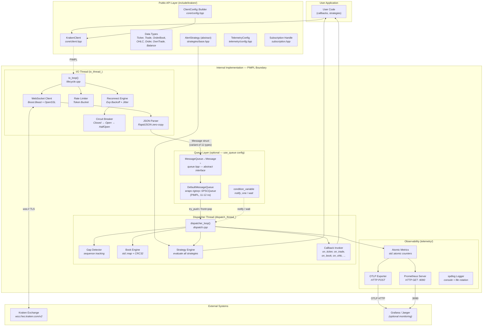

# Architecture Deep-Dive

> Complete system architecture of the Kraken WebSocket SDK — module boundaries, thread ownership, data types, dependencies, and design rationale.

---

## High-Level Design



---

## Thread Ownership

| Thread | Owns | Never Does |
|--------|------|-----------|
| **I/O Thread** (`io_thread_`) | WebSocket I/O, JSON parsing, queue push, heartbeat replies, reconnection, rate limiting | Execute user callbacks, evaluate strategies |
| **Dispatcher Thread** (`dispatch_thread_`) | Queue pop, gap detection, book updates, callback invocation, strategy evaluation, metrics | Network I/O, JSON parsing |
| **User's Thread** (`main`) | `KrakenClient` construction, `subscribe()`, `add_alert()`, `run()` / `run_async()` | Direct access to internal state |

---

## Architecture Modes

| Mode | Data Path | Latency | When to Use |
|------|-----------|---------|-------------|
| **Queue Mode** (default) | I/O Thread → SPSC Queue → Dispatcher Thread → Callbacks | ~12 ns queue overhead | Production — I/O never blocks on slow callbacks |
| **Direct Mode** (`use_queue(false)`) | I/O Thread → Callbacks directly | Minimal | Single-threaded apps or when callbacks are guaranteed fast |

---

## Data Path: Message Lifecycle

```
Kraken Exchange
    │
    ▼ wss:// TLS frame
connection_->receive()              [connection.cpp — Boost.Beast read]
    │
    ▼ raw JSON string
parse_message(raw_json)             [parser.cpp — RapidJSON DOM parse]
    │
    ▼ Message{type, data: variant<11 types>, receive_time, channel, symbol, sequence}
queue_->try_push(move(msg))         [dispatch.cpp:46 — rigtorp::SPSCQueue]
    │
    ▼ queue_cv_.notify_one()        [wake dispatcher]
queue_->front()                     [dispatch.cpp:111 — consumer peek]
    │
    ▼ dispatch(*msg)                [dispatch.cpp:127 — switch on type]
    ├── case Ticker  → ticker_callback_(ticker)     + strategy_engine_.evaluate(ticker)
    ├── case Trade   → trade_callback_(trade)       + strategy_engine_.evaluate(trade)
    ├── case Book    → book_callback_(symbol, book)  + book engine CRC32 check
    ├── case OHLC    → ohlc_callback_(ohlc)
    ├── case Order   → order_callback_(order)        [private channel]
    ├── case OwnTrade → own_trade_callback_(trade)   [private channel]
    ├── case Balance → balance_callback_(balances)   [private channel]
    ├── case Error   → error_callback_(error)
    └── default      → dropped (Heartbeat, Subscribed, Unsubscribed)
    │
    ▼ queue_->pop()                 [dispatch.cpp:128 — free slot]
```

---

## Module Boundaries

### Public API (`include/kraken/`)

What users `#include` — no heavy dependencies leak through:

| Header | Purpose |
|--------|---------|
| `core/client.hpp` | `KrakenClient` — only `unique_ptr<Impl>`, no Boost/SSL |
| `core/config.hpp` | `ClientConfig::Builder` — fluent API |
| `core/types.hpp` | Data structs: `Ticker`, `Trade`, `OrderBook`, `OHLC`, etc. |
| `core/error.hpp` | Error types and `ErrorCode` enum |
| `strategies/base.hpp` | `AlertStrategy` abstract base class |
| `queue.hpp` | `MessageQueue<T>` interface for pluggability |
| `subscription.hpp` | `Subscription` handle (pause/resume/cancel) |
| `telemetry/*.hpp` | Telemetry configuration |

### Internal (`src/internal/`)

Hidden behind PIMPL — never included by consumers:

| Header | Purpose |
|--------|---------|
| `client_impl.hpp` | `KrakenClient::Impl` — all state, threads, queues |
| `connection.hpp` | Boost.Beast WebSocket + OpenSSL |
| `parser.hpp` | RapidJSON → `Message` conversion |
| `book_engine.hpp` | Order book maintenance + CRC32 |
| `auth.hpp` | HMAC-SHA512 authentication |

---

## External Dependencies

| Dependency | Version | Purpose | Fetched Via |
|-----------|---------|---------|-------------|
| [Boost.Beast](https://www.boost.org/doc/libs/release/libs/beast/) | ≥1.70 | WebSocket + Asio I/O | System install |
| [OpenSSL](https://www.openssl.org/) | ≥1.1 | TLS/SSL, HMAC-SHA512 | System install |
| [rigtorp/SPSCQueue](https://github.com/rigtorp/SPSCQueue) | v1.1 | Lock-free SPSC ring buffer | CMake FetchContent |
| [RapidJSON](https://github.com/Tencent/rapidjson) | v1.1.0 | Zero-copy JSON parser | CMake FetchContent |
| [spdlog](https://github.com/gabime/spdlog) | v1.12.0 | Structured logging | CMake FetchContent |

---

## Resilience Components

| Component | Pattern | Trigger | Effect |
|-----------|---------|---------|--------|
| **Circuit Breaker** | Closed → Open → HalfOpen | N consecutive connection failures | Blocks reconnect attempts for timeout period |
| **Exponential Backoff** | 100ms → 200ms → 400ms → ... (with jitter) | Each failed reconnect | Prevents thundering herd on exchange |
| **Rate Limiter** | Token Bucket | Outbound messages (subscribe/unsubscribe) | Prevents Kraken API rate limit violations |
| **Gap Detector** | Sequence tracking per channel/symbol | Missing sequence numbers | Fires error callback for data integrity |
| **CRC32 Checksum** | Book engine validation | Each order book update | Detects book corruption vs exchange state |

---

## Configuration Surface

See [Environment Variables Guide](ENVIRONMENT_VARIABLES.md) for the complete list.

Key configuration points:

```cpp
auto client = ClientConfig::Builder()
    .url("wss://ws.kraken.com/v2")       // Exchange endpoint
    .use_queue(true)                      // Queue mode (default) vs direct mode
    .queue_capacity(131072)               // SPSC ring buffer slots
    .api_key("...")                       // For private channels
    .api_secret("...")
    .build();
```
