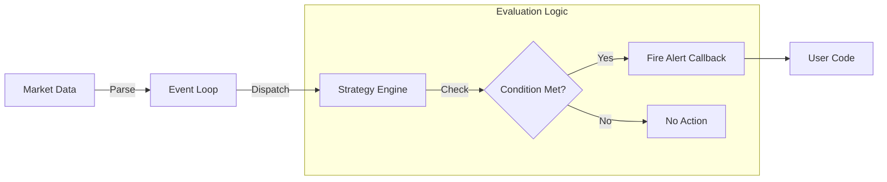

# Trading Strategy Engine

The Kraken SDK allows you to define, configure, and execute trading strategies in real-time. This is not just a data stream; it's a complete trading intelligence system.

## 🚀 Key Features
- **Zero-Latency Evaluation**: Strategies run directly in the hot path.
- **Hot Reload**: Configure strategies via environment variables or JSON without recompiling.
- **Composition**: Combine strategies with `AND`/`OR` logic.
- **Multi-Source**: Trigger alerts based on `Ticker`, `OrderBook`, `Trade`, or a combination.

### Strategy Execution Flow


---

## 🛠️ Configuration Guide

The `StrategyConfig` class allows you to load strategies from configuration files or environment variables.

### 1. Price Alert (`price_alert`)
Simple threshold monitoring.
```cpp
std::map<std::string, std::string> config = {
    {"STRATEGY_TYPE", "price_alert"},
    {"STRATEGY_SYMBOL", "BTC/USD"},
    {"STRATEGY_ABOVE", "50000.0"},
    {"STRATEGY_BELOW", "40000.0"},
    {"STRATEGY_RECURRING", "true"}
};
auto strategy = StrategyConfig::from_map(config);
```

### 2. Volume Spike (`volume_spike`)
Detect abnormal volume activity (e.g., 2.5x the trailing average).
```cpp
std::map<std::string, std::string> config = {
    {"STRATEGY_TYPE", "volume_spike"},
    {"STRATEGY_SYMBOLS", "BTC/USD,ETH/USD"},
    {"STRATEGY_MULTIPLIER", "2.5"},
    {"STRATEGY_LOOKBACK", "50"}
};
```

### 3. Spread Alert (`spread_alert`)
Monitor for arbitrage opportunities or inefficient markets.
```cpp
std::map<std::string, std::string> config = {
    {"STRATEGY_TYPE", "spread_alert"},
    {"STRATEGY_SYMBOL", "BTC/USD"},
    {"STRATEGY_MAX_SPREAD", "10.0"}
};
```

### 4. Presets (`breakout`, `support_level`)
Ready-to-use technical analysis patterns.
```cpp
// Breakout detection
std::map<std::string, std::string> config = {
    {"STRATEGY_TYPE", "breakout"},
    {"STRATEGY_SYMBOL", "BTC/USD"},
    {"STRATEGY_THRESHOLD", "50000.0"},
    {"STRATEGY_VOLUME_MULTIPLIER", "2.0"}
};
```

---

## 💻 Advanced Usage (Code)

For maximum flexibility, subclass `AlertStrategy` to define custom C++ logic.

### 1. Multi-Source Strategies
Combine Order Book depth with Price action.
```cpp
class PriceWithLiquidityStrategy : public AlertStrategy {
    bool check(const Ticker& ticker, const OrderBook& book) override {
        // Price above threshold AND strong order book support (10 BTC buy wall)
        return ticker.last > 50000.0 && 
               book.total_bid_liquidity(5) > 10.0;
    }
    std::string name() const override { return "Price+Liquidity"; }
};
```

### 2. Order Book Imbalance
Detect market pressure before price moves.
```cpp
class ImbalanceStrategy : public AlertStrategy {
    bool needs_orderbook() const override { return true; }
    
    bool check(const OrderBook& book) override {
        // 70% imbalance towards bids (buying pressure)
        return book.imbalance() > 0.7; 
    }
};
```

### 3. Strategy Composition
Combine existing strategies without writing new classes.
```cpp
// Create basic strategies
auto price_alert = std::make_shared<PriceAlert>("BTC/USD", 50000.0);
auto volume_spike = std::make_shared<VolumeSpike>("BTC/USD", 3.0);

// Alert only if BOTH happen:
auto golden_opportunity = CompositeStrategy::and_(price_alert, volume_spike);

client.add_alert(golden_opportunity, callback);
```

---

## 🔮 Future Roadmap

Refining the engine for HFT use cases.
- [ ] **OHLC Data**: Support for candle-based patterns (e.g., RSI, MACD).
- [ ] **Strategy Chains**: If Strategy A fires, automatically enable Strategy B.
- [ ] **Backtesting**: Run strategies against historical data files.
