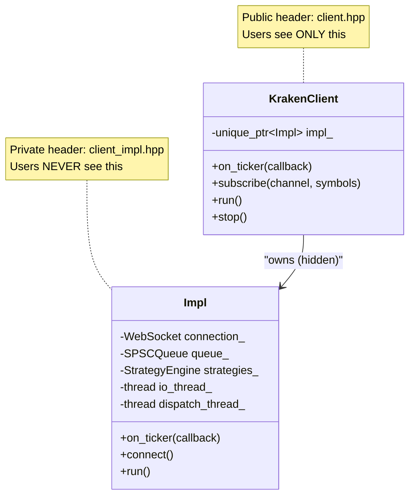
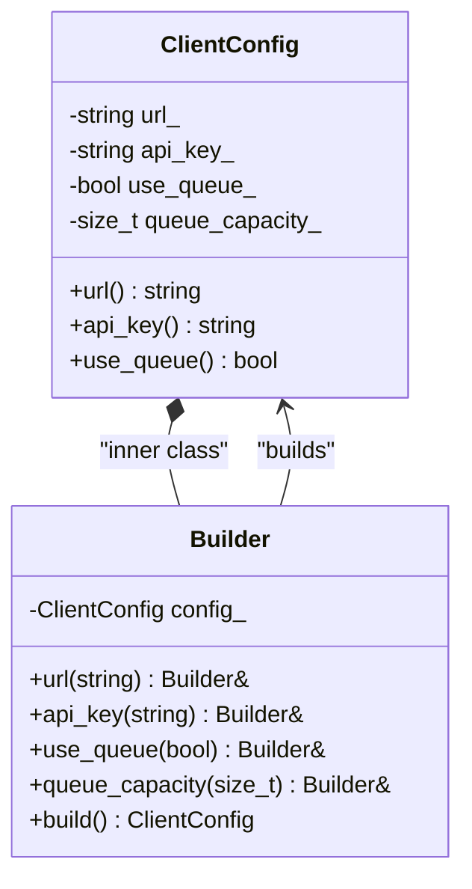
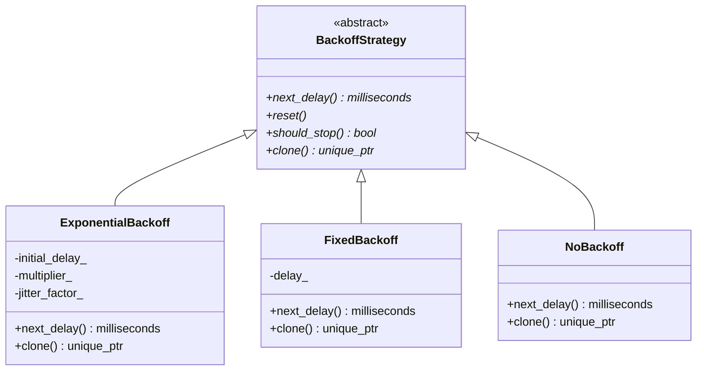
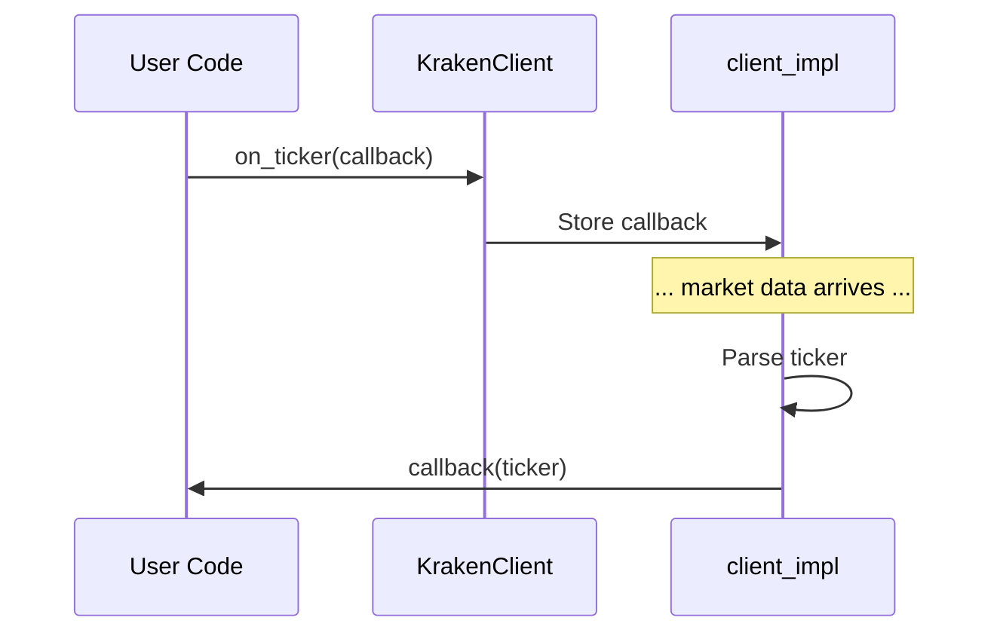
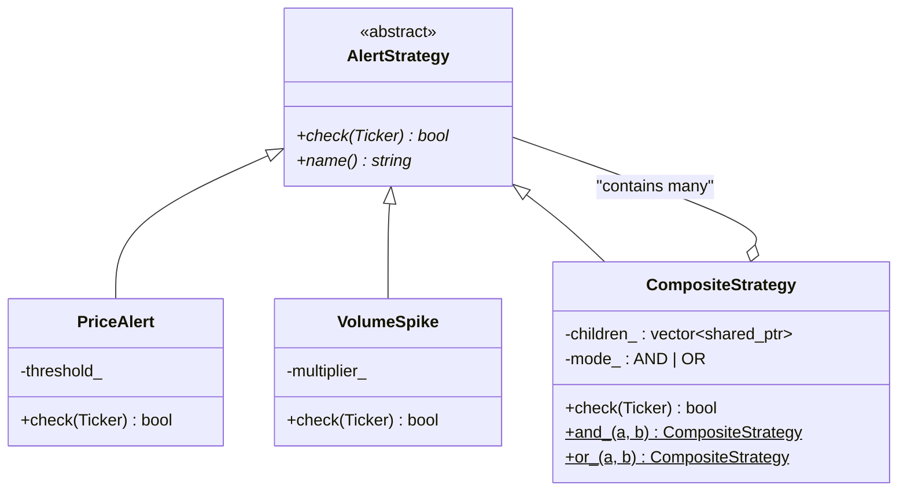
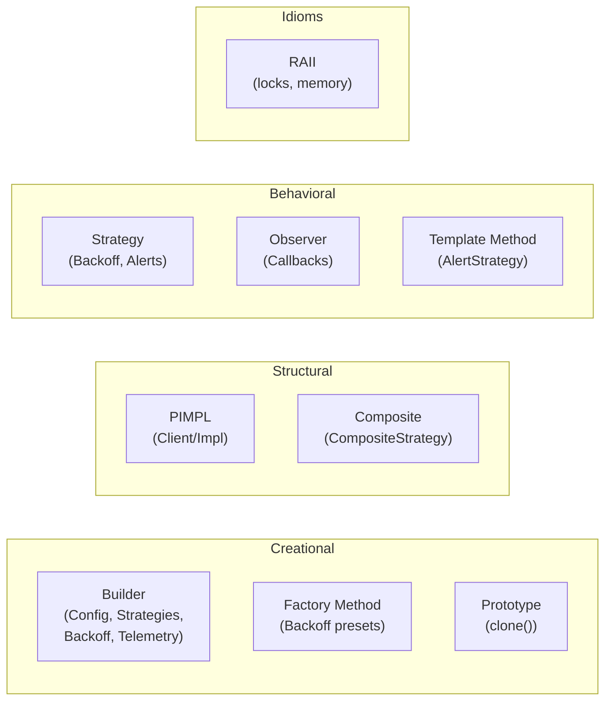

# Chapter 2: Design Patterns

> Every design pattern used in the Kraken SDK, explained with class diagrams and source code references.

---

## Table of Contents
- [2.1 PIMPL (Pointer to Implementation)](#21-pimpl-pointer-to-implementation)
- [2.2 Builder Pattern](#22-builder-pattern)
- [2.3 Strategy Pattern](#23-strategy-pattern)
- [2.4 Observer Pattern (Callbacks)](#24-observer-pattern-callbacks)
- [2.5 Composite Pattern](#25-composite-pattern)
- [2.6 Prototype Pattern](#26-prototype-pattern)
- [2.7 Factory Method Pattern](#27-factory-method-pattern)
- [2.8 Template Method Pattern](#28-template-method-pattern)
- [2.9 RAII (Resource Acquisition Is Initialization)](#29-raii-resource-acquisition-is-initialization)

---

## 2.1 PIMPL (Pointer to Implementation)

### The Problem
If `client.hpp` included all internal headers (Boost.Beast, RapidJSON, queue internals), then **every file that includes `client.hpp`** would also pull in those heavy dependencies. This causes:
- Slow compilation (transitive includes)
- ABI breakage when internal details change
- Leaked implementation details to users

### The Solution
Hide everything behind a forward-declared `Impl` class, stored via `std::unique_ptr<Impl>`.



### How It Works

📄 **Public header:** `include/kraken/core/client.hpp`

```cpp
class KrakenClient {
public:
    void on_ticker(TickerCallback callback);
    void run();
    // ... public API only

private:
    class Impl;                    // Forward declaration — no definition!
    std::unique_ptr<Impl> impl_;   // Pointer to the hidden implementation
};
```

📄 **Private header:** `src/internal/client_impl.hpp`

```cpp
class KrakenClient::Impl {
    // ALL the heavy internals live here
    boost::beast::websocket::stream<...> ws_;
    DefaultMessageQueue<Message> queue_;
    StrategyEngine strategy_engine_;
    std::thread io_thread_;
    // ...
};
```

📄 **Implementation:** `src/core/client.cpp`

```cpp
// Every public method just forwards to impl_
void KrakenClient::on_ticker(TickerCallback callback) {
    impl_->on_ticker(std::move(callback));
}
```

### 💡 Key Benefits

| Benefit | Explanation |
|---------|-------------|
| **ABI Stability** | Changing `Impl` internals doesn't change `client.hpp` → no recompilation for users |
| **Compile Speed** | `client.hpp` has zero heavy includes — users compile faster |
| **Clean API** | Users see exactly what they need, nothing more |
| **Encapsulation** | Impossible to depend on internal types — they're truly hidden |

### ⚠️ Trade-off
Every public method call adds one pointer indirection (`impl_->`). In practice this is negligible — the CPU prefetcher handles it.

---

## 2.2 Builder Pattern

### The Problem
`ClientConfig` has 20+ parameters. A constructor with 20 parameters is unusable:
```cpp
// ❌ What does `true, 131072, true, 5, 2, 30, 5` mean?
ClientConfig config(url, key, secret, true, 131072, true, 5, 2, 30, 5);
```

### The Solution
A **Builder** that produces a **self-documenting** fluent API:
```cpp
// ✅ Every parameter is labeled
auto config = ClientConfig::Builder()
    .url("wss://ws.kraken.com/v2")
    .api_key("your-key")
    .use_queue(true)
    .queue_capacity(131072)
    .circuit_breaker(true)
    .backoff(ExponentialBackoff::conservative())
    .build();
```

### Class Diagram



### Where It's Used

The Builder pattern is used **pervasively** across the SDK — virtually every configurable component uses it:

| Builder | Builds | File |
|---------|--------|------|
| **Core** | | |
| `ClientConfig::Builder` | Client configuration (20+ parameters) | `include/kraken/core/config.hpp` |
| **Connection** | | |
| `ExponentialBackoff::Builder` | Backoff strategy | `include/kraken/connection/backoff.hpp` |
| **Strategies** | | |
| `PriceAlert::Builder` | Price threshold alerts | `include/kraken/strategies/price_alert.hpp` |
| `VolumeSpike::Builder` | Volume spike detection | `include/kraken/strategies/volume_spike.hpp` |
| `SpreadAlert::Builder` | Spread monitoring alerts | `include/kraken/strategies/spread_alert.hpp` |
| **Telemetry** | | |
| `TelemetryConfig::Builder` | OTLP telemetry configuration | `include/kraken/telemetry/config.hpp` |

> [!NOTE]
> Builders are also **composed** — `ClientConfig::Builder` accepts a `TelemetryConfig` built by its own builder, and a backoff strategy built by `ExponentialBackoff::Builder`:
> ```cpp
> auto config = ClientConfig::Builder()
>     .url("wss://ws.kraken.com/v2")
>     .telemetry(TelemetryConfig::Builder()
>         .service_name("my-app")
>         .metrics(true)
>         .build())
>     .backoff(ExponentialBackoff::builder()
>         .initial_delay(std::chrono::seconds(1))
>         .build())
>     .build();
> ```

### The `Builder&` Return Pattern

Every setter returns `Builder&` — a **reference to itself**. This is what enables method chaining:

```cpp
Builder& url(std::string u) {
    config_.url_ = std::move(u);  // Take by value, move into place
    return *this;   // ← Returns reference to same builder
}
```

---

## 2.3 Strategy Pattern

### The Problem
The SDK needs multiple kinds of backoff behavior (exponential, fixed, none) and multiple kinds of alert strategies (price, volume, spread). We can't hardcode these — users may want to add their own.

### The Solution
Define an **abstract interface** and let concrete classes implement the behavior. The client code works with the interface, not the concrete types.



### Where It's Used

📄 **File:** `include/kraken/connection/backoff.hpp`

```cpp
class BackoffStrategy {
public:
    virtual std::chrono::milliseconds next_delay() = 0;  // Pure virtual
    virtual void reset() = 0;
    virtual bool should_stop() const = 0;
    virtual std::unique_ptr<BackoffStrategy> clone() const = 0;
};
```

The same pattern is used for **alert strategies**:

📄 **File:** `include/kraken/strategies/base.hpp`

```cpp
class AlertStrategy {
public:
    virtual bool check(const Ticker& ticker) = 0;   // Pure virtual
    virtual std::string name() const = 0;
    virtual std::vector<std::string> symbols() const = 0;
};
```

### 💡 Key Insight
The Strategy Pattern decouples **what** to do from **when** to do it. The SDK's event loop decides *when* to evaluate; the user's strategy decides *what* to check.

---

## 2.4 Observer Pattern (Callbacks)

### The Problem
The SDK doesn't know what the user wants to do with market data. It could be logging, trading, or displaying on a dashboard. The SDK shouldn't care.

### The Solution
Users **register callbacks** (observers). The SDK **notifies** them when data arrives.



### Where It's Used

📄 **File:** `include/kraken/core/client.hpp` (lines 72–100)

```cpp
void on_ticker(TickerCallback callback);
void on_trade(TradeCallback callback);
void on_book(BookCallback callback);
void on_ohlc(OHLCCallback callback);
void on_error(ErrorCallback callback);
void on_connection_state(ConnectionStateCallback callback);
```

### Key Design Decision: `std::function` vs Virtual Methods

The SDK uses `std::function` instead of a virtual `Observer` interface because:
1. **Simpler API** — Users write a lambda, not a subclass
2. **Per-event granularity** — Subscribe to only the events you care about
3. **No inheritance required** — Callbacks can be free functions, lambdas, or member functions

---

## 2.5 Composite Pattern

### The Problem
Users want to combine strategies: "Alert me when price > $50k **AND** volume is spiking" or "Alert me if price > $50k **OR** spread > $10."

### The Solution
`CompositeStrategy` holds a collection of child strategies and combines their results with AND/OR logic.



### Where It's Used

📄 **File:** `include/kraken/strategies/composite.hpp`

```cpp
// AND composition: fires only if ALL children fire
auto golden = CompositeStrategy::and_(price_alert, volume_spike);

// OR composition: fires if ANY child fires
auto any_signal = CompositeStrategy::or_(price_alert, spread_alert);
```

### 💡 Key Insight
`CompositeStrategy` is itself an `AlertStrategy`. This means composites can contain other composites — enabling arbitrarily complex trees of conditions.

---

## 2.6 Prototype Pattern

### The Problem
The backoff strategy is part of the configuration. When the client reconnects, it needs a **fresh copy** of the backoff strategy (with `attempt_` reset to 0). But the strategy is polymorphic — it could be `ExponentialBackoff`, `FixedBackoff`, or a user-defined type.

### The Solution
Each strategy implements a `clone()` method that returns a `std::unique_ptr<BackoffStrategy>` — a deep copy of itself.

📄 **File:** `include/kraken/connection/backoff.hpp`

```cpp
class ExponentialBackoff : public BackoffStrategy {
    std::unique_ptr<BackoffStrategy> clone() const override {
        auto copy = std::make_unique<ExponentialBackoff>();
        copy->initial_delay_ = initial_delay_;
        copy->max_delay_ = max_delay_;
        copy->multiplier_ = multiplier_;
        copy->jitter_factor_ = jitter_factor_;
        copy->max_attempts_ = max_attempts_;
        copy->attempt_ = 0;  // Reset attempt count on clone
        return copy;
    }
};
```

### 💡 Key Insight
`clone()` returns the base type `unique_ptr<BackoffStrategy>`, not the concrete type. This is the **covariant return through abstract factory** idiom — the caller doesn't need to know the concrete type to get a perfect copy.

---

## 2.7 Factory Method Pattern

### The Problem
Creating an `ExponentialBackoff` with the right parameters for "development" vs "production" requires knowing the right numbers. Users shouldn't have to memorize them.

### The Solution
Static **factory methods** that return pre-configured instances:

📄 **File:** `include/kraken/connection/backoff.hpp`

```cpp
// Production preset
static std::unique_ptr<ExponentialBackoff> conservative() {
    return builder()
        .initial_delay(std::chrono::seconds(1))
        .max_delay(std::chrono::minutes(2))
        .multiplier(2.0)
        .jitter(0.3)
        .max_attempts(10)
        .build();
}

// Testing preset
static std::unique_ptr<ExponentialBackoff> aggressive() {
    return builder()
        .initial_delay(std::chrono::milliseconds(100))
        .max_delay(std::chrono::seconds(5))
        .multiplier(1.5)
        .jitter(0.1)
        .max_attempts(20)
        .build();
}
```

Similarly, `StrategyConfig::from_map()` is a factory that creates the right strategy subtype from a configuration map.

---

## 2.8 Template Method Pattern

### The Problem
All alert strategies share common behavior (symbol matching, enable/disable logic) but differ in their check logic.

### The Solution
The `AlertStrategy` base class provides **default implementations** for optional methods. Subclasses override only what they need.

📄 **File:** `include/kraken/strategies/base.hpp`

```cpp
class AlertStrategy {
public:
    // MUST override (pure virtual)
    virtual bool check(const Ticker& ticker) = 0;
    virtual std::string name() const = 0;
    virtual std::vector<std::string> symbols() const = 0;

    // CAN override (template methods with defaults)
    virtual bool needs_orderbook() const { return false; }
    virtual bool needs_trades() const { return false; }
    virtual bool needs_ohlc() const { return false; }
    virtual bool check(const OrderBook&) { return false; }
    virtual bool check(const Trade&) { return false; }
    virtual bool check(const OHLC&) { return false; }
    virtual bool check(const Ticker&, const OrderBook&) { return false; }
    virtual void reset() {}
    virtual bool is_enabled() const { return true; }
};
```

### 💡 Key Insight
This design means a simple price alert only needs to implement 3 methods (`check`, `name`, `symbols`). A complex multi-source strategy can additionally override `needs_orderbook()` and `check(const OrderBook&)`. The base class handles all the "boilerplate" scenarios with safe defaults.

---

## 2.9 RAII (Resource Acquisition Is Initialization)

### What Is It?
RAII ties the **lifetime of a resource** to the **lifetime of an object**. When the object is created, it acquires the resource. When it's destroyed (goes out of scope), it releases the resource automatically.

### Where It's Used

| Resource | RAII Wrapper | Acquired In | Released In |
|----------|-------------|-------------|-------------|
| WebSocket connection | `KrakenClient` | Constructor / `connect()` | Destructor |
| Threads | `std::thread` | `run()` / `run_async()` | `~Impl()` joins threads |
| Mutex lock | `std::lock_guard<std::mutex>` | Constructor | Destructor (unlock) |
| Memory (Impl) | `std::unique_ptr<Impl>` | `make_unique` | Destructor (delete) |
| Memory (Strategy) | `std::shared_ptr<AlertStrategy>` | `make_shared` | Last ref dies |

### Example: Lock Guard

📄 **File:** `include/kraken/connection/gap_detector.hpp`

```cpp
bool check(const std::string& channel, const std::string& symbol, uint64_t sequence) {
    std::lock_guard<std::mutex> lock(mutex_);  // ← Lock acquired
    // ... critical section ...
    return true;
}  // ← Lock automatically released here, even if exception is thrown
```

### Why RAII Matters
Without RAII:
```cpp
mutex_.lock();
// ... critical section ...
if (error) return false;    // ❌ FORGOT TO UNLOCK! Deadlock.
mutex_.unlock();
```

With RAII:
```cpp
std::lock_guard<std::mutex> lock(mutex_);
// ... critical section ...
if (error) return false;    // ✅ lock_guard destructor unlocks automatically
```

---

## Pattern Summary



---

**Previous:** [← Chapter 1: C++17 Features](01_CPP17_FEATURES.md) · **Next:** [Chapter 3: Concurrency →](03_CONCURRENCY.md)
