# Chapter 3: Concurrency & Threading

> How the Kraken SDK achieves low-latency market data processing using a two-thread reactor model, lock-free queues, atomics, and mutexes.

---

## Table of Contents
- [3.1 The Two-Thread Architecture](#31-the-two-thread-architecture)
- [3.2 Lock-Free SPSC Queue](#32-lock-free-spsc-queue)
- [3.3 std::atomic — Lock-Free Counters](#33-stdatomic--lock-free-counters)
- [3.4 std::mutex & std::lock_guard](#34-stdmutex--stdlock_guard)
- [3.5 std::condition_variable](#35-stdcondition_variable)
- [3.6 Thread Safety in the API](#36-thread-safety-in-the-api)
- [3.7 The `mutable` Keyword](#37-the-mutable-keyword)
- [3.8 Move Semantics in Concurrent Code](#38-move-semantics-in-concurrent-code)
- [3.9 Direct Mode vs Queue Mode](#39-direct-mode-vs-queue-mode)

---

## 3.1 The Two-Thread Architecture

The SDK uses a **Reactor Pattern** with two threads to ensure that slow user callbacks never block the WebSocket connection.


### Why Two Threads?

| Concern | Single Thread (Direct Mode) | Two Threads (Queue Mode) |
|---------|---------------------------|--------------------------|
| **Latency** | Lower (no queue hop) | Slightly higher (+12ns per message) |
| **Callback blocking** | ❌ Slow callback blocks network I/O | ✅ I/O thread never waits for callbacks |
| **Heartbeat safety** | ❌ A slow callback can miss heartbeats | ✅ Heartbeat replies are never delayed |
| **Complexity** | Simpler | More complex (thread coordination) |

### Thread Responsibilities

| Thread | What It Does | What It Never Does |
|--------|-------------|-------------------|
| **I/O Thread** | WebSocket read/write, JSON parse, push to queue, heartbeat replies | Execute user callbacks, evaluate strategies |
| **Dispatcher Thread** | Pop from queue, invoke callbacks, evaluate strategies, collect metrics | Network I/O, JSON parsing |

### 📄 Where It's Defined

`src/internal/client_impl.hpp` — See the `Impl` class members:
```cpp
std::thread io_thread_;        // Network I/O
std::thread dispatch_thread_;  // Callback dispatch
```

---

## 3.2 Lock-Free SPSC Queue

### What Is "Lock-Free"?
A **lock-free** data structure uses **CPU atomic instructions** (like `compare_and_swap`) instead of operating system mutexes. This means:
- No context switches (thread never sleeps)
- No priority inversion
- No deadlocks possible
- Predictable, bounded latency

### SPSC = Single Producer, Single Consumer
The queue has **exactly one writer** (I/O thread) and **exactly one reader** (dispatcher thread). This constraint simplifies the implementation dramatically — no need for multi-producer or multi-consumer coordination.


### How It Works (Simplified)

The queue is a **ring buffer** with two atomic indices:

```
┌──────────────────────────────────────────┐
│  [0] [1] [2] [3] [4] [5] [6] [7] [8] [9]│   ← Ring buffer (capacity = 10)
│           ↑                   ↑          │
│         HEAD                TAIL         │
│       (Consumer)          (Producer)     │
└──────────────────────────────────────────┘
```

- **Producer** writes to `TAIL` and increments it (atomic store)
- **Consumer** reads from `HEAD` and increments it (atomic store)
- When `HEAD == TAIL`, the queue is **empty**
- When `TAIL == HEAD + capacity`, the queue is **full**

No mutex is needed because each index is written by only one thread.

### The Interface

📄 **File:** `include/kraken/queue.hpp`

```cpp
template<typename T>
class MessageQueue {
public:
    virtual bool try_push(T value) = 0;   // Producer: non-blocking
    virtual T* front() = 0;              // Consumer: peek
    virtual void pop() = 0;              // Consumer: remove
    virtual size_t size() const = 0;     // Approximate count
};
```

### Performance

| Operation | Latency |
|-----------|---------|
| `try_push()` | ~11 ns |
| `front()` + `pop()` | ~12 ns |
| **Throughput** | **85M+ ops/sec** |

### Cache Line Padding
The rigtorp::SPSCQueue separates the head and tail indices into **different cache lines** (typically 64 bytes apart). This prevents **false sharing** — where two cores fight over the same cache line even though they're accessing different variables.

```
Cache Line 0: [HEAD, padding, padding, ...]   ← Consumer's cache line
Cache Line 1: [TAIL, padding, padding, ...]   ← Producer's cache line
```

### 💡 Key Insight
The queue uses `std::memory_order_acquire` and `std::memory_order_release` barriers. These are **weaker** than the default `memory_order_seq_cst`, avoiding expensive full memory fences on x86 while still guaranteeing visibility between threads.

---

## 3.3 `std::atomic` — Lock-Free Counters

### What Is It?
`std::atomic<T>` provides thread-safe reads and writes **without a mutex**. The CPU hardware guarantees that loads and stores are indivisible (atomic).

### Where It's Used

📄 **File:** `include/kraken/rate_limiter.hpp`

```cpp
class RateLimiter {
    std::atomic<bool> enabled_;

    // Lock-free statistics
    mutable std::atomic<size_t> total_requests_{0};
    mutable std::atomic<size_t> allowed_requests_{0};
    mutable std::atomic<size_t> rate_limited_{0};
};
```

📄 **File:** `src/internal/client_impl.hpp`

```cpp
class StrategyEngine {
    std::atomic<int> next_id_{1};  // Thread-safe ID generator
};

class KrakenClient::Impl {
    std::atomic<int> next_sub_id_{1};  // Subscription ID generator
};
```

### Common Operations

```cpp
std::atomic<int> counter{0};

counter++;                      // Atomic increment (read-modify-write)
counter.store(42);              // Atomic write
int val = counter.load();       // Atomic read
int old = counter.fetch_add(1); // Atomic increment, returns old value
```

### When to Use `atomic` vs `mutex`

| Scenario | Use `atomic` | Use `mutex` |
|----------|-------------|-------------|
| Single variable, simple ops (++, load, store) | ✅ | Overkill |
| Multiple variables that must change together | ❌ | ✅ |
| Complex invariants (read-then-write) | Sometimes | Usually ✅ |
| Performance-critical counters on hot path | ✅ | Too slow |

---

## 3.4 `std::mutex` & `std::lock_guard`

### What Is It?
A `std::mutex` is a mutual exclusion lock. Only one thread can hold the lock at a time. `std::lock_guard` is an RAII wrapper that automatically locks on creation and unlocks on destruction.

### Where It's Used

📄 **File:** `include/kraken/connection/gap_detector.hpp`

```cpp
class SequenceTracker {
    mutable std::mutex mutex_;
    std::unordered_map<ChannelSymbolKey, uint64_t, ChannelSymbolKeyHash> last_seq_;

    bool check(const std::string& channel, const std::string& symbol, uint64_t seq) {
        std::lock_guard<std::mutex> lock(mutex_);  // ← RAII lock

        auto it = last_seq_.find({channel, symbol});
        if (it == last_seq_.end()) {
            last_seq_.emplace(ChannelSymbolKey{channel, symbol}, seq);
            return true;
        }
        // ... gap detection logic ...
    }  // ← lock automatically released
};
```

📄 **File:** `src/internal/client_impl.hpp`

```cpp
class StrategyEngine {
    mutable std::mutex mutex_;
    std::unordered_map<int, Entry> strategies_;

    int add(std::shared_ptr<AlertStrategy> strategy, AlertCallback callback) {
        std::lock_guard<std::mutex> lock(mutex_);
        int id = next_id_++;
        strategies_[id] = {std::move(strategy), std::move(callback), true};
        return id;
    }
};
```

### The Deadlock Problem
Never hold two mutexes at the same time in inconsistent order:

```cpp
// ❌ DEADLOCK RISK
// Thread 1: lock(A) → lock(B)
// Thread 2: lock(B) → lock(A)

// ✅ SAFE: Always lock in same order, or use std::scoped_lock
std::scoped_lock lock(mutex_a_, mutex_b_);  // C++17: locks both atomically
```

### 💡 Key Insight
The SDK uses mutexes for **complex state** (maps, multi-field updates) and atomics for **simple counters** (metrics, IDs). This is the right balance — mutexes protect invariants, atomics protect individual values.

---

## 3.5 `std::condition_variable`

### What Is It?
A `condition_variable` lets one thread **wait** (sleep efficiently) until another thread signals that data is available. It's more efficient than spin-waiting (busy loop) because the OS suspends the thread.

### How It Works

```mermaid
sequenceDiagram
    participant IO as I/O Thread
    participant CV as condition_variable
    participant DP as Dispatcher Thread

    Note over DP: wait(lock, predicate)
    Note over DP: 💤 Sleeping...

    IO->>IO: Push message to queue
    IO->>CV: notify_one()

    CV->>DP: Wake up!
    Note over DP: Check predicate → true
    DP->>DP: Process message
```



### Pattern Used in the SDK

```cpp
// Dispatcher thread (consumer)
void dispatch_loop() {
    while (running_) {
        std::unique_lock<std::mutex> lock(cv_mutex_);
        cv_.wait(lock, [this] {
            return !queue_.empty() || !running_;  // Predicate
        });
        // Process messages...
    }
}

// I/O thread (producer)
void on_message(const std::string& raw_json) {
    Message msg = parse_message(raw_json);
    queue_.try_push(std::move(msg));
    cv_.notify_one();  // Wake up dispatcher
}
```

### Why Not Spin-Wait?

| Approach | CPU Usage | Latency | Power |
|----------|-----------|---------|-------|
| `while (!queue.empty()) {}` (Spin) | 100% core | ~ns | High |
| `condition_variable::wait()` | ~0% when idle | ~μs on wake | Low |

For market data, a few microseconds of wake-up latency is acceptable. Burning a full CPU core on a spin loop is wasteful when markets are quiet.

---

## 3.6 Thread Safety in the API

The `KrakenClient` header explicitly documents which methods are thread-safe:

📄 **File:** `include/kraken/core/client.hpp` (comments on lines 29–34)

```cpp
/**
 * Thread-safe for:
 * - Callback registration (on_ticker, on_error, etc.)
 * - Subscriptions (subscribe, subscribe_book)
 * - Alert strategies (add_alert, remove_alert)
 * - Connection state queries (is_connected)
 * - Metrics (get_metrics)
 */
```

### How Thread Safety Is Achieved

| API Category | Protection Mechanism |
|-------------|---------------------|
| Callbacks | Stored behind mutex in `Impl` |
| Subscriptions | `subscriptions_mutex_` guards the subscription map |
| Strategies | `StrategyEngine::mutex_` guards strategy map |
| Metrics | `std::atomic` counters (no lock needed) |
| Connection state | `std::atomic<ConnectionState>` |
| Data snapshots | Returns copies (not references) via `std::optional` |

### The Snapshot Pattern

```cpp
std::optional<Ticker> latest_ticker(const std::string& symbol) const {
    std::lock_guard<std::mutex> lock(tickers_mutex_);
    auto it = latest_tickers_.find(symbol);
    if (it == latest_tickers_.end()) return std::nullopt;
    return it->second;  // ← Returns a COPY, not a reference
}
```

By returning a **copy** wrapped in `std::optional`, the caller gets their own data that can be used without any synchronization concerns.

---

## 3.7 The `mutable` Keyword

### What Is It?
`mutable` allows a member to be modified even in a `const` method. This seems contradictory, but it's essential for synchronization primitives.

### Why It's Needed

```cpp
class SequenceTracker {
    mutable std::mutex mutex_;                     // ← mutable!
    mutable std::atomic<size_t> total_requests_;   // ← mutable!

    // const method needs to lock the mutex
    uint64_t gap_count() const {             // Note: const
        std::lock_guard<std::mutex> lock(mutex_);  // Modifies mutex (lock it)
        return gap_count_;
    }
};
```

Without `mutable`, you couldn't call `gap_count()` on a `const` reference to a `SequenceTracker`, even though the method logically doesn't modify any observable state. The mutex is an implementation detail of thread safety, not part of the object's logical state.

### Rule of Thumb
Mark synchronization primitives (`mutex`, `atomic` counters for stats, cache variables) as `mutable`. Never mark business data as `mutable`.

---

## 3.8 Move Semantics in Concurrent Code

### Why Move Matters in Queues

Copying a `Message` (which contains a `std::variant` of `Ticker`, `OrderBook`, etc.) is expensive. Moving transfers ownership of the internal data pointers without copying the actual data.

```cpp
// I/O thread: parse and move into queue
Message msg = parse_message(raw_json);
queue_.try_push(std::move(msg));
// msg is now in a moved-from state — do NOT read from it

// Dispatcher thread: use and discard
Message* front = queue_.front();
dispatch(*front);   // Use the data
queue_.pop();       // Destroy the message in the queue
```

### Why Move Matters in Callbacks

```cpp
void KrakenClient::on_ticker(TickerCallback callback) {
    impl_->on_ticker(std::move(callback));
}
```

A `std::function` (like `TickerCallback`) may hold a lambda with captured data. Moving it avoids copying that captured state — especially important if the lambda captures things like vectors or strings.

---

## 3.9 Direct Mode vs Queue Mode

The SDK supports two threading models, configurable at construction:


### Configuration

```cpp
// Queue mode (default)
auto config = ClientConfig::Builder()
    .use_queue(true)
    .queue_capacity(131072)   // 128K slots
    .build();

// Direct mode (single thread)
auto config = ClientConfig::Builder()
    .use_queue(false)
    .build();
```

### When to Use Which

| Scenario | Recommended Mode |
|----------|-----------------|
| Production trading system | Queue Mode (safety) |
| Ultra-low-latency HFT | Direct Mode (minimal latency) |
| Simple data logging | Either (Direct is simpler) |
| Heavy computation in callbacks | Queue Mode (don't block I/O) |

### 💡 Key Insight
Direct mode saves ~12ns per message but creates a coupling between network I/O and callback execution. If a user callback takes 10ms (e.g., writing to a database), the WebSocket won't read new messages during that time, potentially causing missed heartbeats and disconnection.

---

## Concurrency Summary

| Concept | Where Used | Why |
|---------|-----------|-----|
| Two-thread reactor | `Impl` class | Decouple I/O from logic |
| SPSC Queue | Between I/O and dispatcher | Lock-free data transfer |
| `std::atomic` | Metrics, IDs, flags | Lock-free simple counters |
| `std::mutex` | Strategy map, subscription map, gap tracker | Protect complex state |
| `std::lock_guard` | Everywhere a mutex is used | RAII locking |
| `std::condition_variable` | Dispatcher thread wake-up | Efficient sleep/wake |
| `mutable` | Mutex and atomic members | Allow in `const` methods |
| Move semantics | Queue push, callback registration | Avoid costly copies |

---

**Previous:** [← Chapter 2: Design Patterns](02_DESIGN_PATTERNS.md) · **Next:** [Chapter 4: System Design →](04_SYSTEM_DESIGN.md)
