# Chapter 4: System Design & Architecture

> How the Kraken SDK is structured as a modular, event-driven system — from high-level data flow to configuration management.

---

## Table of Contents
- [4.1 Event-Driven Architecture](#41-event-driven-architecture)
- [4.2 End-to-End Data Flow](#42-end-to-end-data-flow)
- [4.3 Modular Architecture](#43-modular-architecture)
- [4.4 Connection State Machine](#44-connection-state-machine)
- [4.5 Configuration Architecture](#45-configuration-architecture)
- [4.6 Subscription Lifecycle](#46-subscription-lifecycle)
- [4.7 Message Dispatch Table](#47-message-dispatch-table)
- [4.8 Error Handling Strategy](#48-error-handling-strategy)

---

## 4.1 Event-Driven Architecture

The SDK is built around an **event-driven** model: external data arrives as events, and the system reacts by dispatching them to registered handlers.


### Key Principles

| Principle | Implementation |
|-----------|---------------|
| **Inversion of Control** | The SDK calls your code (callbacks), not the other way around |
| **Loose Coupling** | Callbacks are `std::function` — any callable works |
| **Single Responsibility** | Parser only parses, Dispatcher only dispatches, Strategies only evaluate |
| **Non-blocking I/O** | Network thread is never blocked by user logic (in queue mode) |

---

## 4.2 End-to-End Data Flow

This is the complete lifecycle of a single market data message:


### Latency Breakdown

| Stage | Typical Latency |
|-------|----------------|
| Network → Boost.Beast | Variable (network) |
| JSON Parse | ~1.8 μs |
| Queue Push/Pop | ~12 ns |
| Strategy Evaluation | ~100 ns per strategy |
| **Total SDK overhead** | **< 5 μs** |

### Producer / Consumer Code Paths

The I/O thread (producer) and dispatcher thread (consumer) interact through the SPSC queue:

```cpp
// Producer (I/O thread): non-blocking push
if (queue_->try_push(std::move(msg))) {
    queue_cv_.notify_one();     // Wake consumer
} else {
    msg_dropped_.fetch_add(1);  // Backpressure: drop + count
}

// Consumer (dispatcher thread): peek-dispatch-pop
if (Message* msg = queue_->front()) {
    dispatch(*msg);             // Invoke user callbacks + strategies
    queue_->pop();              // Remove from ring buffer
} else {
    queue_cv_.wait(lock, ...);  // Sleep until notified
}
```

The queue is **optional** — `use_queue(false)` dispatches directly in the I/O thread for minimal latency.

> 📘 For the full deep-dive on SPSC queue internals, message sizing, and improvement ideas, see [Chapter 3: Lock-Free SPSC Queue](03_CONCURRENCY.md#32-lock-free-spsc-queue)

---

## 4.3 Modular Architecture

The SDK is organized into **four modules**, each with its own `include/` and `src/` subdirectory:


### Module Responsibilities

| Module | Purpose | Key Files |
|--------|---------|-----------|
| **core/** | Public API, data types, configuration | `client.hpp`, `types.hpp`, `config.hpp`, `error.hpp` |
| **strategies/** | Trading intelligence engine | `base.hpp`, `price_alert.hpp`, `spread_alert.hpp`, `volume_spike.hpp`, `composite.hpp`, `presets.hpp`, `strategy_config.hpp` |
| **telemetry/** | Monitoring and metrics export | `telemetry.hpp`, `metrics_collector.hpp`, `prometheus_server.hpp`, `otlp_exporter.hpp` |
| **connection/** | Resilience and reconnection logic | `backoff.hpp`, `circuit_breaker.hpp`, `gap_detector.hpp`, `connection_config.hpp` |
| **internal/** | Private implementation details | `client_impl.hpp`, `parser.hpp`, `book_engine.hpp`, `connection.hpp`, `auth.hpp` |

> 📘 For detailed strategy engine architecture, see [`docs/STRATEGY_ENGINE.md`](../docs/STRATEGY_ENGINE.md)

### The `client/` Subdirectory

The PIMPL implementation (`Impl`) is split across multiple `.cpp` files for maintainability:

| File | Responsibility |
|------|---------------|
| `lifecycle.cpp` | Constructor, destructor, `connect()`, `disconnect()`, `run()` |
| `callbacks.cpp` | `on_ticker()`, `on_trade()`, etc. |
| `subscriptions.cpp` | `subscribe()`, `subscribe_book()`, etc. |
| `subscription_impl.cpp` | Internal subscription management |
| `strategies.cpp` | `add_alert()`, `remove_alert()`, etc. |
| `strategy_engine_impl.cpp` | Strategy engine evaluation logic |
| `dispatch.cpp` | Message dispatch loop, callback invocation |
| `reconnect.cpp` | Reconnection logic with backoff |
| `snapshots.cpp` | `latest_ticker()`, `latest_book()` |
| `metrics.cpp` | `get_metrics()` |

### 💡 Key Insight
Splitting one class across multiple `.cpp` files is unusual but effective. Each file is a logical unit of functionality. This makes the 400+ line `Impl` class manageable — you edit `reconnect.cpp` when working on reconnection logic without touching `dispatch.cpp`.

---

## 4.4 Connection State Machine

The connection follows a strict state machine:


### State Transitions

📄 **File:** `include/kraken/core/types.hpp` (lines 67–72)

```cpp
enum class ConnectionState {
    Disconnected,   // Not connected
    Connecting,     // Connection attempt in progress
    Connected,      // Connected and ready
    Reconnecting    // Reconnecting after disconnection
};
```

### State Change Notifications

Users can observe state transitions:

```cpp
client.on_connection_state([](ConnectionState state) {
    std::cout << "Connection: " << kraken::to_string(state) << std::endl;
});
```

---

## 4.5 Configuration Architecture

The SDK supports **three layers** of configuration, with a clear priority order:

```mermaid
graph TD
    subgraph Priority["Configuration Priority (highest → lowest)"]
        direction TB
        Builder["1. Builder Pattern<br/>(Programmatic)"]
        Env["2. Environment Variables<br/>(Deployment)"]
        File["3. Config File (.cfg)<br/>(Examples)"]
        Defaults["4. Hardcoded Defaults"]
    end

    Builder --> Config[ClientConfig]
    Env --> Config
    File --> Config
    Defaults --> Config

    Config --> Client[KrakenClient]
```



### Layer 1: Builder Pattern (Programmatic)

```cpp
auto config = ClientConfig::Builder()
    .url("wss://ws.kraken.com/v2")
    .use_queue(true)
    .queue_capacity(131072)
    .build();
```

### Layer 2: Environment Variables

```bash
export ENABLE_SPSC_QUEUE="true"
export SPSC_QUEUE_SIZE="131072"
```

```cpp
auto config = kraken::config_from_env();  // Reads all env vars
```

### Layer 3: Config File

```
ENABLE_SPSC_QUEUE=true
SPSC_QUEUE_SIZE=131072
```

### 💡 Key Insight
Environment variables are the recommended approach for **production deployments** because they allow changing behavior without recompiling. The Builder is for library integration where compile-time configuration is preferred.

> 📘 For configuration validation details, see [`docs/CONFIGURATION_VALIDATION.md`](../docs/CONFIGURATION_VALIDATION.md)
> 
> 📘 For the full list of environment variables, see [`docs/ENVIRONMENT_VARIABLES.md`](../docs/ENVIRONMENT_VARIABLES.md)

---

## 4.6 Subscription Lifecycle

Subscriptions are managed through a `Subscription` handle that provides lifecycle control:


📄 **File:** `include/kraken/subscription.hpp`

```cpp
Subscription sub = client.subscribe(Channel::Ticker, {"BTC/USD"});

sub.pause();                      // Temporarily stop updates
sub.resume();                     // Resume updates
sub.add_symbols({"ETH/USD"});     // Dynamically add symbols
sub.remove_symbols({"BTC/USD"});  // Remove symbols
sub.unsubscribe();                // Permanently unsubscribe
```

### Auto-Resubscription

After a reconnection, the SDK automatically resubscribes to all active subscriptions. The subscription handle remains valid across reconnections — user code doesn't need to track reconnection events.

---

## 4.7 Message Dispatch Table

The dispatcher uses the `MessageType` enum to route messages to the correct handler. This is essentially a compile-time dispatch table:


### Safe Callback Invocation

📄 **File:** `src/internal/client_impl.hpp` (lines 263–273)

```cpp
template<typename Callback, typename... Args>
void safe_invoke_callback(Callback&& callback, Args&&... args) {
    try {
        if (callback) {
            std::forward<Callback>(callback)(std::forward<Args>(args)...);
        }
    } catch (const std::exception& e) {
        // Log error, don't crash
        if (error_callback_) {
            error_callback_(Error{ErrorCode::CallbackError, e.what()});
        }
    }
}
```

This template ensures that **user exceptions never crash the SDK**. If a user's callback throws, it's caught and reported via the error callback.

---

## 4.8 Error Handling Strategy

The SDK uses a **dual error handling** approach:


### Philosophy

| Phase | Mechanism | Rationale |
|-------|-----------|-----------|
| **Setup** | Exceptions | Constructor/connect failures should halt startup |
| **Runtime** | Callbacks | A running system should never crash — report errors and continue |

### Error Codes

📄 **File:** `include/kraken/core/types.hpp` (lines 49–62)

```cpp
enum class ErrorCode : std::uint8_t {
    None = 0,
    ConnectionFailed,
    ConnectionClosed,
    AuthenticationFailed,
    InvalidSymbol,
    InvalidOrder,
    RateLimited,
    QueueOverflow,
    ChecksumMismatch,
    ParseError,
    Timeout,
    CallbackError
};
```

---

**Previous:** [← Chapter 3: Concurrency](03_CONCURRENCY.md) · **Next:** [Chapter 5: Networking →](05_NETWORKING.md)
