# Chapter 5: Networking & Protocols

> WebSocket protocol, Boost.Beast, TLS/SSL, JSON parsing with RapidJSON, authentication, and the Kraken API message format.

---

## Table of Contents
- [5.1 WebSocket Protocol](#51-websocket-protocol)
- [5.2 Boost.Beast & Boost.Asio](#52-boostbeast--boostasio)
- [5.3 TLS/SSL with OpenSSL](#53-tlsssl-with-openssl)
- [5.4 JSON Parsing with RapidJSON](#54-json-parsing-with-rapidjson)
- [5.5 Kraken v2 API Message Format](#55-kraken-v2-api-message-format)
- [5.6 HMAC-SHA512 Authentication](#56-hmac-sha512-authentication)
- [5.7 Subscription Protocol](#57-subscription-protocol)

---

## 5.1 WebSocket Protocol

### What Is WebSocket?
WebSocket is a **full-duplex** communication protocol over a single TCP connection. Unlike HTTP (request → response), WebSocket allows **both sides** to send messages at any time.


### WebSocket vs HTTP

| Feature | HTTP | WebSocket |
|---------|------|-----------|
| Communication | Request → Response | Full-duplex |
| Connection | New TCP for each request* | Single persistent TCP |
| Overhead | Headers on every request | Minimal frame headers (2-14 bytes) |
| Latency | High (handshake per request) | Low (already connected) |
| Use case | RESTful APIs | Real-time streaming |

*HTTP/2 allows multiplexing, but WebSocket is still simpler for real-time data.

### Frame Types

| Frame | Purpose | SDK Usage |
|-------|---------|-----------|
| **Text** | UTF-8 data (JSON messages) | All market data |
| **Binary** | Raw bytes | Not used |
| **Ping** | Keepalive request | Server sends periodically |
| **Pong** | Keepalive response | SDK responds automatically |
| **Close** | Connection teardown | Graceful disconnect |

---

## 5.2 Boost.Beast & Boost.Asio

### What Is Boost.Asio?
Boost.Asio is a **cross-platform asynchronous I/O library**. It provides the event loop and networking primitives (TCP, UDP, timers). Think of it as the OS-level networking abstraction.

### What Is Boost.Beast?
Boost.Beast is built on top of Asio and adds **HTTP and WebSocket** protocol support. It handles the WebSocket handshake, frame encoding/decoding, and TLS negotiation.

### Layer Diagram


### Asio's `io_context` (Event Loop)

The core of Asio is the `io_context` — a thread-safe event loop that dispatches I/O completion handlers:

```cpp
boost::asio::io_context ioc;

// Post work to the event loop
boost::asio::post(ioc, [] {
    std::cout << "Executed on the I/O thread" << std::endl;
});

// Run the event loop (blocks until all work is done)
ioc.run();  // ← This is what the I/O thread runs
```

### Async Read Pattern

```cpp
// Boost.Beast async read (simplified)
ws_.async_read(buffer_, [this](boost::system::error_code ec, size_t bytes) {
    if (ec) {
        handle_error(ec);
        return;
    }

    std::string raw_json = beast::buffers_to_string(buffer_.data());
    buffer_.consume(bytes);

    Message msg = parse_message(raw_json);
    queue_.try_push(std::move(msg));

    // Schedule next read (continues the loop)
    do_read();
});
```

### 💡 Key Insight
Asio uses **proactor pattern** on Windows (IOCP) and **reactor pattern** on Linux (epoll). The SDK's code is the same on both platforms — Asio abstracts away the OS differences.

---

## 5.3 TLS/SSL with OpenSSL

### Why TLS?
The Kraken WebSocket endpoint (`wss://ws.kraken.com`) uses TLS (Transport Layer Security) to encrypt all communication. Without TLS, market data and API keys would be transmitted in plaintext.

### TLS Handshake

```mermaid
sequenceDiagram
    participant Client as SDK
    participant Server as Kraken

    Client->>Server: ClientHello (supported ciphers, TLS version)
    Server->>Client: ServerHello (chosen cipher, certificate)
    Client->>Client: Verify certificate (OpenSSL CA bundle)
    Client->>Server: Key exchange (ECDHE)
    Note over Client,Server: ← Encrypted Channel Established →
    Client->>Server: WebSocket Upgrade (over encrypted channel)
```



### SDK Configuration

📄 **File:** `include/kraken/connection/connection_config.hpp`

```cpp
struct SecurityConfig {
    bool verify_certificates = true;   // Verify server's TLS certificate
    std::string ca_cert_path;          // Custom CA certificate file
    std::string client_cert_path;      // Client certificate (mutual TLS)
    std::string client_key_path;       // Client private key
};
```

### 💡 Key Insight
The `wss://` prefix means "WebSocket Secure" — similar to how `https://` means "HTTP Secure". The SDK always uses `wss://` for production connections to Kraken. You configure TLS through `ClientConfig::Builder::security(SecurityConfig{...})`.

---

## 5.4 JSON Parsing with RapidJSON

### Why RapidJSON?
The SDK parses thousands of JSON messages per second. RapidJSON is chosen for its **zero-copy** parsing and minimal memory allocation.

### DOM vs SAX Parsing

| Approach | How It Works | Memory | Speed |
|----------|-------------|--------|-------|
| **DOM** (used here) | Parse entire JSON into a tree | Higher | Fast access to any field |
| **SAX** | Stream through tokens, fire events | Lower | Faster parse, complex code |

The SDK uses DOM parsing because messages are small (< 1KB) and we need random access to fields.

### Parser Helpers

📄 **File:** `src/parser.cpp`

```cpp
namespace {

// Safe string extraction with default value
std::string get_string(const rapidjson::Value& obj, const char* key,
                       const std::string& def = "") {
    if (obj.HasMember(key) && obj[key].IsString())
        return obj[key].GetString();
    return def;
}

// Safe double extraction — handles both number and string representations
double get_double(const rapidjson::Value& obj, const char* key, double def = 0.0) {
    if (!obj.HasMember(key)) return def;
    const auto& val = obj[key];
    if (val.IsDouble()) return val.GetDouble();
    if (val.IsInt()) return static_cast<double>(val.GetInt());
    if (val.IsString()) {
        // Kraken sends some numbers as strings
        try { return std::stod(val.GetString()); }
        catch (...) { return def; }
    }
    return def;
}

}  // anonymous namespace
```

### 💡 Key Insight
Kraken's API sends some numeric values as **strings** (e.g., `"50123.45"` instead of `50123.45`). The `get_double` helper handles both formats gracefully. This is a common quirk with financial APIs to preserve decimal precision.

### Parsing a Ticker

```cpp
Ticker parse_ticker(const rapidjson::Value& data, const std::string& symbol, bool& ok) {
    Ticker t;
    t.symbol = symbol;
    t.bid  = get_double(data, "bid");
    t.ask  = get_double(data, "ask");
    t.last = get_double(data, "last");
    t.volume_24h = get_double(data, "volume");
    t.high_24h   = get_double(data, "high");
    t.low_24h    = get_double(data, "low");
    ok = true;
    return t;
}
```

---

## 5.5 Kraken v2 API Message Format

### Inbound Messages (Server → Client)

All messages from Kraken follow this structure:

```json
{
  "channel": "ticker",
  "type": "update",
  "data": [
    {
      "symbol": "BTC/USD",
      "bid": 50123.45,
      "ask": 50124.00,
      "last": 50123.90,
      "volume": 1234.56
    }
  ]
}
```

### Message Types

| `channel` | `type` | Meaning |
|-----------|--------|---------|
| `heartbeat` | — | Keep-alive signal |
| `ticker` | `update` | Real-time price data |
| `trade` | `update` | New trade executed |
| `book` | `snapshot` | Full order book |
| `book` | `update` | Incremental book changes |
| `ohlc` | `update` | Candle data |
| `status` | — | System status messages |

### Outbound Messages (Client → Server)

```json
{
  "method": "subscribe",
  "params": {
    "channel": "ticker",
    "symbol": ["BTC/USD", "ETH/USD"]
  }
}
```

### Build Subscribe Message

📄 **File:** `src/parser.cpp`

```cpp
std::string build_subscribe_message(Channel channel,
                                    const std::vector<std::string>& symbols,
                                    int depth) {
    // Constructs the JSON subscribe message using RapidJSON
    // Returns: {"method":"subscribe","params":{"channel":"ticker","symbol":["BTC/USD"]}}
}
```

---

## 5.6 HMAC-SHA512 Authentication

### What Is HMAC?
HMAC (Hash-based Message Authentication Code) is a mechanism for verifying both data integrity and authenticity. HMAC-SHA512 combines the SHA-512 hash function with a secret key.

### Authentication Flow


### HMAC-SHA512 Signature

📄 **File:** `src/auth.cpp`

The authentication process:
1. **Nonce**: Generate a unique timestamp-based nonce
2. **Post data**: `nonce=<nonce>`
3. **Message**: `nonce + post_data`
4. **Hash**: SHA-256(message)
5. **Sign**: HMAC-SHA512(base64_decode(api_secret), uri_path + hash)
6. **Encode**: Base64 encode the signature

### 💡 Key Insight
The API key identifies *who* you are. The HMAC signature proves you have the secret without transmitting it. Even if someone intercepts the request, they can't forge new requests without the secret.

---

## 5.7 Subscription Protocol

### Subscribe Flow


### Unsubscribe Flow

```mermaid
sequenceDiagram
    participant SDK as SDK
    participant WS as Kraken WS

    SDK->>WS: {"method":"unsubscribe","params":{"channel":"ticker","symbol":["BTC/USD"]}}
    WS->>SDK: {"method":"unsubscribe","result":{...},"success":true}
    Note over SDK: Subscription removed → stop processing
```



### Auto-Resubscription After Reconnect

When the connection drops and is restored, the SDK automatically:
1. Clears the gap detector state (`reset_all()`)
2. Iterates through all active `SubscriptionImpl` objects
3. Re-sends subscribe messages for each one
4. Waits for confirmation before marking subscriptions as active again

This is transparent to the user — their `Subscription` handles remain valid.

---

**Previous:** [← Chapter 4: System Design](04_SYSTEM_DESIGN.md) · **Next:** [Chapter 6: Resilience →](06_RESILIENCE.md)
