# Chapter 6: Resilience & Fault Tolerance

> How the Kraken SDK protects against network failures, data corruption, API rate limits, and cascading failures.

---

## Table of Contents
- [6.1 Circuit Breaker Pattern](#61-circuit-breaker-pattern)
- [6.2 Exponential Backoff with Jitter](#62-exponential-backoff-with-jitter)
- [6.3 Token Bucket Rate Limiter](#63-token-bucket-rate-limiter)
- [6.4 CRC32 Checksum Validation](#64-crc32-checksum-validation)
- [6.5 Gap Detection (Sequence Tracking)](#65-gap-detection-sequence-tracking)
- [6.6 Safe Callback Invocation](#66-safe-callback-invocation)
- [6.7 Graceful Degradation](#67-graceful-degradation)

---

## 6.1 Circuit Breaker Pattern

### The Problem
If the Kraken API goes down and your SDK keeps reconnecting immediately in a tight loop, you:
1. **Waste resources** — CPU, network bandwidth
2. **DDoS the exchange** — thousands of clients retrying simultaneously
3. **Never recover gracefully** — no backoff, no breathing room

### The Solution
A **circuit breaker** tracks connection failures and "trips" (opens) after a threshold, preventing further attempts for a cooldown period.

```mermaid
stateDiagram-v2
    [*] --> Closed

    state Closed {
        [*] --> Normal
        Normal --> Normal: Connection success ✅\n(reset failure count)
        Normal --> CountFailure: Connection failure ❌\n(increment counter)
        CountFailure --> Normal: failures < threshold
    }

    Closed --> Open: failures ≥ 5 (threshold)

    state Open {
        [*] --> Rejecting
        Rejecting --> Rejecting: All connection attempts\nrejected immediately ⛔
    }

    Open --> HalfOpen: 30s timeout elapsed ⏱️

    state HalfOpen {
        [*] --> Testing
        Testing --> ProbeSuccess: Connection success ✅
        ProbeSuccess --> Testing: successes < threshold
    }

    HalfOpen --> Closed: successes ≥ 2 (threshold) 🎉
    HalfOpen --> Open: Any failure ❌
```



### Configuration

📄 **File:** `include/kraken/core/config.hpp`

```cpp
auto config = ClientConfig::Builder()
    .circuit_breaker(
        true,                          // enabled
        5,                             // failure_threshold (trip after 5 failures)
        2,                             // success_threshold (close after 2 successes)
        std::chrono::seconds(30),      // open_state_timeout (wait before half-open)
        std::chrono::seconds(5)        // half_open_timeout
    )
    .build();
```

### States Explained

| State | Behavior | Duration |
|-------|----------|----------|
| **Closed** | Normal operation — connections allowed | Until failure threshold reached |
| **Open** | All connections rejected immediately (no network call) | `open_state_timeout` (30s default) |
| **HalfOpen** | Limited probe connections allowed to test recovery | Until success threshold or any failure |

### 💡 Key Insight
The circuit breaker protects **both parties**: the client (avoids wasting resources on a dead endpoint) and the exchange (avoids being overwhelmed during outages). It's a pattern from distributed systems, adapted here for WebSocket reconnection.

---

## 6.2 Exponential Backoff with Jitter

### The Problem
If 10,000 clients lose connection at the same time and all retry after exactly 1 second, the exchange gets 10,000 simultaneous reconnection attempts — a **thundering herd**.

### The Solution
**Exponential backoff** increases the delay between retries. **Jitter** adds randomness to spread out retries over time.

### The Math

```
delay = min(initial_delay × multiplier^attempt, max_delay) × (1 ± jitter)
```

Example with `initial=1s, multiplier=2.0, jitter=0.3`:

| Attempt | Base Delay | With Jitter (±30%) | Actual Range |
|---------|-----------|---------------------|--------------|
| 1 | 1s | 1s × (0.7–1.3) | 0.7s – 1.3s |
| 2 | 2s | 2s × (0.7–1.3) | 1.4s – 2.6s |
| 3 | 4s | 4s × (0.7–1.3) | 2.8s – 5.2s |
| 4 | 8s | 8s × (0.7–1.3) | 5.6s – 10.4s |
| 5 | 16s | 16s × (0.7–1.3) | 11.2s – 20.8s |
| ... | ... capped at max_delay (60s) | ... | ... |


### Implementation

📄 **File:** `include/kraken/connection/backoff.hpp`

```cpp
std::chrono::milliseconds next_delay() override {
    // Base delay: initial × multiplier^attempt
    double base_ms = static_cast<double>(initial_delay_.count())
                   * std::pow(multiplier_, attempt_);

    // Cap at max delay
    base_ms = std::min(base_ms, static_cast<double>(max_delay_.count()));

    // Apply jitter: delay × (1 + random(-jitter, +jitter))
    if (jitter_factor_ > 0.0) {
        std::uniform_real_distribution<double> dist(-jitter_factor_, jitter_factor_);
        base_ms = base_ms * (1.0 + dist(rng_));
    }

    attempt_++;
    return std::chrono::milliseconds(static_cast<int64_t>(base_ms));
}
```

### Presets

| Preset | Initial | Max | Multiplier | Jitter | Max Attempts |
|--------|---------|-----|-----------|--------|-------------|
| `aggressive()` | 100ms | 5s | 1.5× | 10% | 20 |
| `conservative()` | 1s | 2min | 2.0× | 30% | 10 |
| `infinite()` | 1s | 5min | 2.0× | 30% | ∞ |

---

## 6.3 Token Bucket Rate Limiter

### The Problem
Kraken limits the number of API messages per second. Sending too fast results in disconnection or IP bans.

### The Algorithm
Imagine a bucket that holds tokens. Tokens are added at a steady rate (e.g., 10/second). Each outbound message consumes one token. If the bucket is empty, the message is delayed.

```mermaid
graph TD
    subgraph "Token Bucket"
        Bucket["🪣 Bucket\n(max: 20 tokens)"]
        Refill["⏱️ Refill Rate: 10 tokens/sec"]
        Refill -->|+1 token every 100ms| Bucket
    end

    MSG["Outbound Message"] --> Check{Tokens > 0?}
    Check -- Yes --> Send["✅ Send\n(consume 1 token)"]
    Check -- No --> Wait["⏳ Wait\n(until token available)"]
    Wait -.-> Check

    Bucket --> Check
```



### Implementation

📄 **File:** `include/kraken/rate_limiter.hpp`

```cpp
class RateLimiter {
    mutable std::mutex mutex_;
    mutable double tokens_;              // Current token count (fractional)
    double refill_rate_;                 // Tokens per second
    size_t max_tokens_;                  // Burst capacity

    bool acquire() {
        // Refill tokens based on elapsed time
        refill_tokens();

        if (tokens_ >= 1.0) {
            tokens_ -= 1.0;
            allowed_requests_++;
            return true;    // ✅ Token acquired
        }

        rate_limited_++;
        return false;       // ❌ Rate limited
    }
};
```

### Key Properties

| Property | Value | Meaning |
|----------|-------|---------|
| `requests_per_sec` | 10.0 | Steady-state rate (10 msgs/sec) |
| `burst_size` | 20 | Can send 20 messages instantly (burst) |
| `tokens_` | Fractional | Allows for sub-second precision |

### Burst vs Steady-State

- **Burst**: If you haven't sent anything for 2 seconds, 20 tokens have accumulated → you can send 20 messages instantly
- **Steady-state**: After the burst, you're limited to 10 messages/second
- **Backpressure**: If the bucket is empty, `acquire()` returns `false` and the caller must wait

---

## 6.4 CRC32 Checksum Validation

### The Problem
Order book data is transmitted as **incremental updates** (deltas). If a single update is lost or corrupted, the local order book becomes permanently wrong — prices might be stale, quantities incorrect. For trading, this is catastrophic.

### The Solution
Kraken sends a CRC32 checksum with each order book snapshot. The SDK computes its own CRC32 over the local book state and compares it.

```mermaid
flowchart LR
    Update["Book Update\n(from exchange)"] --> Apply["Apply Delta\nto Local Book"]
    Apply --> Compute["Compute CRC32\nof Local State"]
    Exchange["Exchange CRC32\n(from message)"] --> Compare{Match?}
    Compute --> Compare

    Compare -- Yes --> Valid["✅ is_valid = true\n(Data is correct)"]
    Compare -- No --> Invalid["⚠️ is_valid = false\n(Data corrupted!)"]
    Invalid --> Recover["Request fresh\nsnapshot"]
```



### How CRC32 Works

CRC32 is a hash function that produces a 32-bit checksum. Any change to the input (even a single bit) produces a completely different output.

📄 **File:** `src/book_engine.cpp`

The SDK's book engine:
1. Maintains the order book as a `std::map` (sorted by price)
2. Applies incremental deltas (new levels, removed levels, quantity changes)
3. After each update, computes CRC32 over the top-10 bid/ask levels
4. Compares against the server-provided checksum
5. Sets `OrderBook::is_valid` accordingly

### User-Level Handling

```cpp
client.on_book([](const std::string& symbol, const OrderBook& book) {
    if (!book.is_valid) {
        std::cerr << "⚠️ Checksum mismatch for " << symbol << std::endl;
        // Consider requesting a fresh snapshot
        return;
    }

    // Safe to use validated data
    std::cout << "Spread: $" << book.spread() << std::endl;
});
```

---

## 6.5 Gap Detection (Sequence Tracking)

### The Problem
WebSocket messages can be lost during network glitches. If messages are lost:
- Missing ticker updates → stale prices
- Missing book updates → CRC32 failures
- Missing trade updates → incorrect position tracking

### The Solution
Track **sequence numbers** per channel/symbol. If a message arrives with sequence N+2 when we expected N+1, we know message N+1 was lost.

📄 **File:** `include/kraken/connection/gap_detector.hpp`

```cpp
class SequenceTracker {
    bool check(const std::string& channel, const std::string& symbol, uint64_t seq) {
        auto it = last_seq_.find({channel, symbol});

        if (it == last_seq_.end()) {
            // First message — initialize
            last_seq_[{channel, symbol}] = seq;
            return true;
        }

        uint64_t expected = it->second + 1;

        if (seq == expected) {
            it->second = seq;
            return true;      // ✅ No gap
        }

        if (seq > expected) {
            // Forward gap — messages were skipped
            report_gap(channel, symbol, expected, seq, seq - expected);
            it->second = seq;  // Accept to avoid cascade
            return false;      // ❌ Gap detected
        }

        // seq < expected — out-of-order message
        if (config_.track_reorders) {
            report_gap(channel, symbol, expected, seq, expected - seq - 1);
            return false;
        }
        return true;
    }
};
```

### Optimized Key Hashing

The tracker uses a custom `ChannelSymbolKey` struct with **FNV-1a style hash mixing** to avoid string concatenation on the hot path:

```cpp
struct ChannelSymbolKeyHash {
    size_t operator()(const ChannelSymbolKey& key) const {
        size_t h1 = std::hash<std::string>{}(key.channel);
        size_t h2 = std::hash<std::string>{}(key.symbol);
        return h1 ^ (h2 + 0x9e3779b9U + ((h1 << 6U) | (h1 >> 2U)));
    }
};
```

The magic constant `0x9e3779b9` is the **golden ratio** as a 32-bit integer, used to spread hash bits evenly.

---

## 6.6 Safe Callback Invocation

### The Problem
User-provided callback code might throw exceptions. If an exception propagates into the SDK's dispatch loop, it would crash the entire application.

### The Solution
Every callback invocation is wrapped in a try/catch:

📄 **File:** `src/internal/client_impl.hpp`

```cpp
template<typename Callback, typename... Args>
void safe_invoke_callback(Callback&& callback, Args&&... args) {
    try {
        if (callback) {
            std::forward<Callback>(callback)(std::forward<Args>(args)...);
        }
    } catch (const std::exception& e) {
        if (error_callback_) {
            Error err;
            err.code = ErrorCode::CallbackError;
            err.message = e.what();
            error_callback_(err);
        }
    } catch (...) {
        // Unknown exception — log and continue
    }
}
```

### Layer of Defense

```
User Callback
    ↓ throws
safe_invoke_callback catches
    ↓ reports to
error_callback_ (user's error handler)
    ↓ if that also throws
SILENTLY CAUGHT — SDK continues running
```

---

## 6.7 Graceful Degradation

### What Happens When Things Fail?

| Failure | SDK Response | User Notification |
|---------|-------------|-------------------|
| WebSocket disconnected | Enter Reconnecting state, backoff retry | `on_connection_state(Reconnecting)` |
| Queue overflow | Drop oldest messages | `on_error(QueueOverflow)` |
| CRC32 mismatch | Mark book as invalid, continue receiving | `on_book(book.is_valid = false)` |
| Sequence gap | Report gap, accept the new sequence | Gap callback fired |
| User callback throws | Catch, report, continue processing | `on_error(CallbackError)` |
| Rate limit exceeded | Delay outbound message | Internal wait + log |
| Circuit breaker open | Reject connections, wait for timeout | `on_connection_state` stays Reconnecting |
| Max reconnect attempts | Give up, enter Disconnected | `on_connection_state(Disconnected)` |

### 💡 Key Principle
The SDK **never crashes**. Every failure mode has a defined response that keeps the system running (or gracefully shuts down). This is critical for financial applications where a crash can mean missed trades or orphaned orders.

---

**Previous:** [← Chapter 5: Networking](05_NETWORKING.md) · **Next:** [Chapter 7: Observability →](07_OBSERVABILITY.md)
