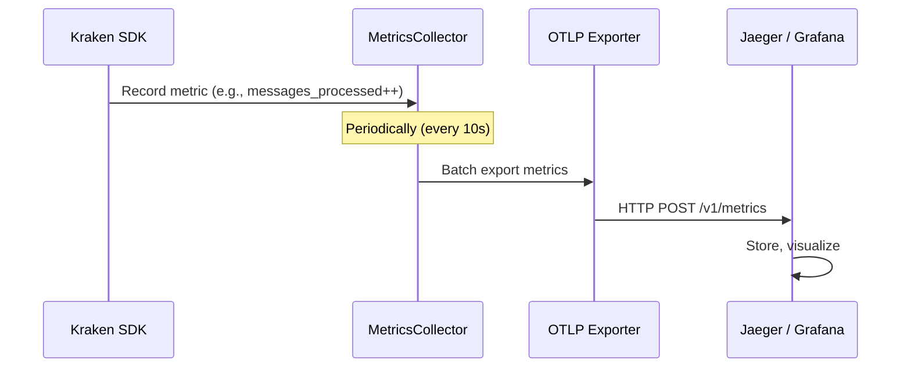
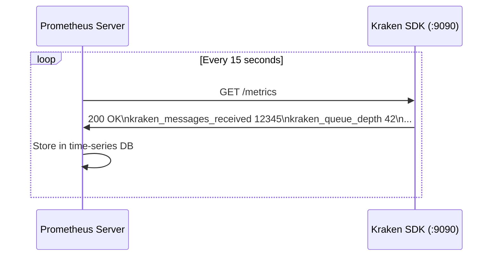

# Chapter 7: Observability & Monitoring

> How the Kraken SDK exposes internal state through structured logging, metrics, OpenTelemetry, and Prometheus for production monitoring.

---

## Table of Contents
- [7.1 The Observability Stack](#71-the-observability-stack)
- [7.2 Structured Logging with spdlog](#72-structured-logging-with-spdlog)
- [7.3 Metrics Architecture](#73-metrics-architecture)
- [7.4 OpenTelemetry (OTLP)](#74-opentelemetry-otlp)
- [7.5 Prometheus Endpoint](#75-prometheus-endpoint)
- [7.6 Performance Dashboard](#76-performance-dashboard)

---

## 7.1 The Observability Stack

Observability answers three questions about your running system:
1. **What happened?** → Logs
2. **How much?** → Metrics
3. **Where and when?** → Traces (spans)

```mermaid
graph TD
    subgraph "Kraken SDK"
        Logs["spdlog\n(Structured Logs)"]
        Metrics["Metrics API\n(atomic counters)"]
        OTLP["OTLP Exporter\n(HTTP)"]
        Prom["Prometheus Server\n(HTTP /metrics)"]
    end

    subgraph "External Systems"
        Files["Log Files\n(rotated)"]
        Console["Console\n(colored output)"]
        Jaeger["Jaeger / Tempo\n(Trace viewer)"]
        Grafana["Grafana\n(Dashboards)"]
        PromServer["Prometheus Server\n(Scraper)"]
    end

    Logs --> Files
    Logs --> Console
    OTLP -->|HTTP POST| Jaeger
    OTLP -->|HTTP POST| Grafana
    Prom -->|HTTP GET /metrics| PromServer
    PromServer --> Grafana
    Metrics -->|get_metrics()| Dashboard["Terminal Dashboard\n(built-in example)"]
```

### Why Both OTLP and Prometheus?

| Protocol | Model | Best For |
|----------|-------|----------|
| **OTLP** (OpenTelemetry) | Push (SDK sends data) | Cloud environments (Jaeger, Datadog) |
| **Prometheus** | Pull (Prometheus scrapes SDK) | On-premise monitoring |

Supporting both gives users flexibility to integrate with their existing monitoring stack.

---

## 7.2 Structured Logging with spdlog

### What Is Structured Logging?
Instead of free-form text, structured logs use a **consistent format** with fields like timestamp, level, source, and message. This makes logs machine-parseable for aggregation tools (ELK, Splunk, Loki).

### Where It's Used

📄 **File:** `include/kraken/logger.hpp`

```cpp
namespace kraken {

class Logger {
public:
    static void init(const std::string& name = "kraken",
                     spdlog::level::level_enum level = spdlog::level::info);

    static std::shared_ptr<spdlog::logger> get();
};

}  // namespace kraken
```

### Log Levels

| Level | When to Use | Example |
|-------|------------|---------|
| `trace` | Hyper-verbose debugging | Every JSON message parsed |
| `debug` | Development diagnostics | Subscription confirmed |
| `info` | Normal operation milestones | Connected, subscribed |
| `warn` | Potential issues | CRC32 mismatch, gap detected |
| `error` | Failures that are handled | Connection lost, callback threw |
| `critical` | Unrecoverable failures | Out of memory |

### spdlog Features Used

| Feature | Purpose |
|---------|---------|
| **Colored console** | Easy visual scanning in development |
| **File rotation** | Prevents log files from growing unbounded |
| **Async logging** | Logging doesn't block the hot path |
| **Format strings** | `spdlog::info("Price: {}", price)` — fmt-style |
| **Multiple sinks** | Console + file simultaneously |

### Configuration

```cpp
// Set log level via environment variable
export KRAKEN_LOG_LEVEL="debug"

// Or programmatically
kraken::Logger::init("kraken", spdlog::level::debug);
```

---

## 7.3 Metrics Architecture

### Local Metrics API

The SDK collects performance metrics using lock-free atomic counters and exposes them via `get_metrics()`:

📄 **File:** `include/kraken/metrics.hpp`

```cpp
struct Metrics {
    uint64_t messages_received = 0;   // Total messages from WebSocket
    uint64_t messages_processed = 0;  // Messages dispatched to callbacks
    uint64_t messages_dropped = 0;    // Messages dropped (queue overflow)
    uint64_t parse_errors = 0;        // JSON parse failures
    uint64_t checksum_failures = 0;   // CRC32 mismatches
    uint64_t reconnections = 0;       // Number of reconnections

    size_t queue_depth = 0;           // Current queue occupancy
    size_t queue_capacity = 0;        // Queue capacity

    double uptime_seconds = 0.0;      // Time since connection

    ConnectionState connection_state; // Current connection state

    // Computed metrics
    double throughput() const {
        return uptime_seconds > 0 ? messages_processed / uptime_seconds : 0;
    }

    double drop_rate() const {
        return messages_received > 0
            ? (static_cast<double>(messages_dropped) / messages_received) * 100.0
            : 0.0;
    }
};
```

### Usage

```cpp
auto metrics = client.get_metrics();
std::cout << "Throughput: " << metrics.throughput() << " msgs/sec" << std::endl;
std::cout << "Queue: " << metrics.queue_depth << "/" << metrics.queue_capacity << std::endl;
std::cout << "Drop rate: " << metrics.drop_rate() << "%" << std::endl;
```

### Why Atomic Counters?

Metrics are updated on the I/O thread and read from the user thread. Using `std::atomic` avoids locking entirely:

```cpp
// I/O thread (writer)
messages_received_.fetch_add(1, std::memory_order_relaxed);

// User thread (reader)
uint64_t count = messages_received_.load(std::memory_order_relaxed);
```

`memory_order_relaxed` is sufficient for counters because we don't need ordering guarantees — we just need the increment to be atomic. This is the fastest possible atomic operation.

---

## 7.4 OpenTelemetry (OTLP)

### What Is OpenTelemetry?
OpenTelemetry (OTel) is a **vendor-neutral** standard for collecting telemetry data (metrics, traces, logs). OTLP (OpenTelemetry Protocol) is its wire format, typically sent over HTTP or gRPC.

### Architecture



### SDK Components

📄 **Files:** `include/kraken/telemetry/`

| Component | File | Purpose |
|-----------|------|---------|
| `Telemetry` | `telemetry.hpp` | Main orchestrator — initializes all telemetry |
| `TelemetryConfig` | `config.hpp` | Configuration (endpoint, interval, etc.) |
| `MetricsCollector` | `metrics_collector.hpp` | Collects and aggregates metrics |
| `OTLPExporter` | `otlp_exporter.hpp` | Exports metrics via HTTP POST |
| `PrometheusServer` | `prometheus_server.hpp` | Serves `/metrics` for Prometheus scraping |

### Configuration

```cpp
auto config = ClientConfig::Builder()
    .telemetry(TelemetryConfig::Builder()
        .enable_http_server(true)    // Start Prometheus endpoint
        .http_server_port(9090)      // Listen on :9090
        .build())
    .build();
```

### 💡 Key Insight
OpenTelemetry is a **push** model — the SDK pushes metrics to a collector. This is ideal for containerized environments (Kubernetes) where the collector runs as a sidecar. For traditional server setups, Prometheus pull is often simpler.

---

## 7.5 Prometheus Endpoint

### What Is Prometheus?
Prometheus is a time-series database that **scrapes** (pulls) metrics from your application at regular intervals. It expects metrics in a specific text format exposed at an HTTP endpoint.

### How It Works



### Prometheus Text Format

```
# HELP kraken_messages_received Total messages received from WebSocket
# TYPE kraken_messages_received counter
kraken_messages_received 12345

# HELP kraken_queue_depth Current SPSC queue depth
# TYPE kraken_queue_depth gauge
kraken_queue_depth 42

# HELP kraken_checksum_failures Total CRC32 checksum failures
# TYPE kraken_checksum_failures counter
kraken_checksum_failures 0
```

### Metric Types

| Type | Behavior | Example |
|------|----------|---------|
| **Counter** | Only goes up | `messages_received`, `reconnections` |
| **Gauge** | Goes up and down | `queue_depth`, `uptime_seconds` |
| **Histogram** | Distribution of values | Parse latency (not implemented yet) |

### 💡 Key Insight
The Prometheus endpoint runs in its own thread inside the SDK. It handles HTTP requests independently of the I/O and dispatcher threads, so scraping metrics never interferes with market data processing.

---

## 7.6 Performance Dashboard

The SDK includes a built-in terminal dashboard example that uses `get_metrics()` to display live statistics:

```
╔══════════════════════════════════════════════════╗
║         Kraken SDK Performance Dashboard         ║
╠══════════════════════════════════════════════════╣
║ Status: CONNECTED            Uptime: 01:23:45   ║
║─────────────────────────────────────────────────-║
║ Messages Received:    1,234,567                  ║
║ Messages Processed:   1,234,560                  ║
║ Messages Dropped:     7 (0.001%)                 ║
║ Throughput:           2,345 msgs/sec             ║
║─────────────────────────────────────────────────-║
║ Queue Depth:          42 / 131,072               ║
║ Checksum Failures:    0                          ║
║ Reconnections:        1                          ║
║ Gaps Detected:        0                          ║
╚══════════════════════════════════════════════════╝
```

### How It Works

```cpp
while (running) {
    auto m = client.get_metrics();

    clear_screen();
    print_header();
    print_metric("Messages Received", m.messages_received);
    print_metric("Throughput", m.throughput(), "msgs/sec");
    print_metric("Queue Depth", m.queue_depth, m.queue_capacity);
    print_metric("Drop Rate", m.drop_rate(), "%");

    std::this_thread::sleep_for(std::chrono::seconds(1));
}
```

### 💡 Key Insight
The dashboard example demonstrates that `get_metrics()` is designed for **continuous polling** — it's thread-safe, O(1) (just loading atomic counters), and can be called thousands of times per second without affecting SDK performance.

---

## Observability Summary

| Layer | Tool | Data | Transport |
|-------|------|------|-----------|
| **Logging** | spdlog | Text messages with levels | Console + files |
| **Local Metrics** | `get_metrics()` | Counters + gauges | In-process API call |
| **Push Metrics** | OTLP Exporter | OpenTelemetry format | HTTP POST |
| **Pull Metrics** | Prometheus Server | Prometheus text format | HTTP GET |
| **Dashboard** | Terminal UI (example) | Formatted metrics | Console |

---

**Previous:** [← Chapter 6: Resilience](06_RESILIENCE.md) · **Next:** [Chapter 8: Testing →](08_TESTING.md)
