# Chapter 8: Testing & Quality Assurance

> Google Test, Google Benchmark, stress testing, static analysis, and CI/CD — how the Kraken SDK ensures correctness and performance.

---

## Table of Contents
- [8.1 Testing Philosophy](#81-testing-philosophy)
- [8.2 Google Test Framework](#82-google-test-framework)
- [8.3 Test Categories](#83-test-categories)
- [8.4 Google Benchmark](#84-google-benchmark)
- [8.5 Stress & Failure Testing](#85-stress--failure-testing)
- [8.6 Static Analysis (Clang-Tidy)](#86-static-analysis-clang-tidy)
- [8.7 CI/CD Pipeline](#87-cicd-pipeline)

---

## 8.1 Testing Philosophy

### The Testing Pyramid


### Key Principles

| Principle | Implementation |
|-----------|---------------|
| **Fast feedback** | Unit tests run in seconds, not minutes |
| **No network dependency** | Tests mock the WebSocket — no live exchange needed |
| **Deterministic** | No flaky tests — fixed seeds for random generators |
| **High coverage** | 25 test suites, 328 test cases, 100% pass rate |
| **Performance regression** | Benchmarks run in CI to catch performance regressions |

---

## 8.2 Google Test Framework

### Key Concepts

Google Test (gtest) provides:

| Concept | Purpose | Example |
|---------|---------|---------|
| `TEST(Suite, Name)` | Define a standalone test | `TEST(Parser, ParsesTicker)` |
| `TEST_F(Fixture, Name)` | Test using a shared fixture | `TEST_F(BookTest, AppliesDelta)` |
| `EXPECT_*` | Non-fatal assertions (continue on failure) | `EXPECT_EQ(a, b)` |
| `ASSERT_*` | Fatal assertions (stop on failure) | `ASSERT_NE(ptr, nullptr)` |

### Example: Unit Test

```cpp
TEST(ParserTest, ParsesTickerCorrectly) {
    std::string json = R"({
        "channel": "ticker",
        "type": "update",
        "data": [{
            "symbol": "BTC/USD",
            "bid": 50000.0,
            "ask": 50001.0,
            "last": 50000.5,
            "volume": 1234.56
        }]
    })";

    auto msg = kraken::parse_message(json);

    ASSERT_EQ(msg.type, kraken::MessageType::Ticker);
    ASSERT_TRUE(msg.holds<kraken::Ticker>());

    const auto& ticker = msg.get<kraken::Ticker>();
    EXPECT_EQ(ticker.symbol, "BTC/USD");
    EXPECT_DOUBLE_EQ(ticker.bid, 50000.0);
    EXPECT_DOUBLE_EQ(ticker.ask, 50001.0);
    EXPECT_DOUBLE_EQ(ticker.last, 50000.5);
    EXPECT_NEAR(ticker.spread(), 1.0, 0.001);
}
```

### Test Fixtures

Fixtures set up common state that multiple tests share:

```cpp
class BookEngineTest : public ::testing::Test {
protected:
    void SetUp() override {
        engine_ = std::make_unique<kraken::BookEngine>();
        // Pre-populate with a known book state
        engine_->apply_snapshot(create_test_snapshot());
    }

    void TearDown() override {
        engine_.reset();
    }

    std::unique_ptr<kraken::BookEngine> engine_;
};

TEST_F(BookEngineTest, AppliesBidUpdate) {
    engine_->apply_delta(create_bid_update(50000.0, 1.5));
    auto book = engine_->get_book("BTC/USD");
    EXPECT_DOUBLE_EQ(book.bids[0].price, 50000.0);
    EXPECT_DOUBLE_EQ(book.bids[0].quantity, 1.5);
}

TEST_F(BookEngineTest, ChecksumValidation) {
    engine_->apply_delta(create_bid_update(50000.0, 1.5));
    auto book = engine_->get_book("BTC/USD");
    EXPECT_TRUE(book.is_valid);  // CRC32 matches
}
```

### `EXPECT_*` vs `ASSERT_*`

| Macro | On Failure | Use When |
|-------|-----------|----------|
| `EXPECT_EQ(a, b)` | Log failure, **continue** test | Non-critical checks |
| `ASSERT_EQ(a, b)` | Log failure, **abort** test | Critical preconditions |

Rule: Use `ASSERT_*` for conditions that later code depends on (e.g., pointer not null before dereference). Use `EXPECT_*` for everything else to see all failures in one run.

---

## 8.3 Test Categories

### 25 Test Suites

| Category | Test Suites | What They Cover |
|----------|-------------|-----------------|
| **Core Parsing** | Parser, Types | JSON → struct conversion, edge cases |
| **Order Book** | BookEngine, Checksum | Delta application, CRC32 validation |
| **Config** | Config, ConfigEnv | Builder, env vars, file parsing |
| **Auth** | Authentication | HMAC-SHA512 signature generation |
| **Logging** | Logger | Log levels, spdlog initialization |
| **Queue** | SPSCQueue | Push/pop, overflow, empty |
| **Rate Limiter** | RateLimiter | Token bucket, burst, blocking |
| **Strategies** | PriceAlert, VolumeSpike, SpreadAlert, Composite, Presets, Config, EnableDisable | All strategy types |
| **Integration** | EndToEnd | Message flow: parse → queue → dispatch |
| **Thread Safety** | Concurrent | Parallel callback registration, metrics reading |
| **Edge Cases** | EdgeCases | Boundary conditions, empty inputs |
| **Exception Safety** | ExceptionSafety | Error handling, callback exceptions |
| **Stress** | StressTests | 40+ failure scenarios |

### Example Test Names

```
[  PASSED  ] ParserTest.ParsesTickerCorrectly
[  PASSED  ] ParserTest.HandlesEmptyJSON
[  PASSED  ] ParserTest.HandlesMalformedJSON
[  PASSED  ] ParserTest.ParsesNumericStrings
[  PASSED  ] BookEngineTest.AppliesSnapshot
[  PASSED  ] BookEngineTest.AppliesDelta
[  PASSED  ] BookEngineTest.RemovesPriceLevel
[  PASSED  ] BookEngineTest.ChecksumMatch
[  PASSED  ] BookEngineTest.ChecksumMismatch
[  PASSED  ] StrategyTest.PriceAlertFires
[  PASSED  ] StrategyTest.PriceAlertDoesNotFireBelowThreshold
[  PASSED  ] StrategyTest.CompositeAND
[  PASSED  ] StrategyTest.CompositeOR
[  PASSED  ] ConcurrentTest.ParallelCallbackRegistration
[  PASSED  ] StressTest.QueueOverflowRecovery
```

---

## 8.4 Google Benchmark

### What Is It?
Google Benchmark is a **micro-benchmarking** framework that measures the latency of individual operations with statistical rigor. It handles warm-up, multiple iterations, and reports mean/median/stddev.

### Where It's Used

📄 **File:** `benchmarks/`

```cpp
static void BM_QueuePushPop(benchmark::State& state) {
    DefaultMessageQueue<Message> queue(65536);
    Message msg = create_test_ticker();

    for (auto _ : state) {
        queue.try_push(std::move(msg));
        auto* front = queue.front();
        benchmark::DoNotOptimize(front);
        queue.pop();
        msg = create_test_ticker();  // Reset for next iteration
    }
}
BENCHMARK(BM_QueuePushPop);

static void BM_ParseTicker(benchmark::State& state) {
    std::string json = create_ticker_json();

    for (auto _ : state) {
        auto msg = parse_message(json);
        benchmark::DoNotOptimize(msg);
    }
}
BENCHMARK(BM_ParseTicker);
```

### Benchmark Results

| Benchmark | Latency | Throughput |
|-----------|---------|------------|
| `BM_QueuePushPop` | ~12 ns | 85M ops/sec |
| `BM_ParseTicker` | ~1.8 μs | 550K msgs/sec |
| `BM_BookUpdate` | ~51 ns | 19M updates/sec |
| `BM_ChecksumCalculation` | ~24 μs | 41K/sec |

### Key Functions

| Function | Purpose |
|----------|---------|
| `benchmark::DoNotOptimize(x)` | Prevent compiler from optimizing away the result |
| `state.SetBytesProcessed(n)` | Report throughput in bytes/sec |
| `state.SetItemsProcessed(n)` | Report throughput in items/sec |
| `BENCHMARK(...)->Arg(N)` | Parameterize with different input sizes |

### 💡 Key Insight
`DoNotOptimize` is critical. Without it, the compiler might see that the result of `parse_message()` is never used and **remove the entire call**. This would make your benchmark appear infinitely fast — completely useless.

---

## 8.5 Stress & Failure Testing

### What Is Stress Testing?
Stress tests push the system beyond normal operating conditions to find breaking points, race conditions, and recovery failures.

### Categories of Stress Tests


### Example Stress Tests

```cpp
TEST(StressTest, QueueOverflowRecovery) {
    // Fill the queue beyond capacity and verify no crash
    DefaultMessageQueue<Message> queue(16);  // Tiny queue

    for (int i = 0; i < 1000; i++) {
        bool pushed = queue.try_push(create_test_ticker());
        if (!pushed) {
            // Queue full — this is expected, verify no crash
        }
    }
    // Verify queue still works after overflow
    EXPECT_LE(queue.size(), 16);
}

TEST(StressTest, RapidReconnection) {
    // Connect and disconnect 100 times rapidly
    for (int i = 0; i < 100; i++) {
        KrakenClient client;
        client.connect();
        client.disconnect();
    }
    // If we get here without crash/hang, the test passes
}

TEST(StressTest, CallbackExceptionRecovery) {
    KrakenClient client;
    client.on_ticker([](const Ticker&) {
        throw std::runtime_error("User bug!");
    });
    // Feed a message through — the SDK should catch and continue
    // Verify no crash
}
```

---

## 8.6 Static Analysis (Clang-Tidy)

### What Is Clang-Tidy?
Clang-Tidy is a **static analysis** tool that finds bugs, style issues, and potential performance problems without running the code.

📄 **File:** `.clang-tidy`

### Rules Used

| Check | What It Catches |
|-------|----------------|
| `bugprone-*` | Common bug patterns (dangling references, integer overflow) |
| `cppcoreguidelines-*` | C++ Core Guidelines violations |
| `modernize-*` | Old C++ patterns that have modern replacements |
| `readability-*` | Code readability issues |
| `performance-*` | Unnecessary copies, inefficient patterns |
| `hicpp-*` | High-Integrity C++ rules |

### NOLINT Annotations

When a Clang-Tidy warning is a false positive (or intentional), the code uses `NOLINT`:

```cpp
// Magic numbers are intentional configuration defaults
std::chrono::milliseconds initial_delay_{1000};  // NOLINT(readability-magic-numbers)

// snprintf requires C-style varargs — intentional for performance
const int result = snprintf(buf.data(), buf.size(), ...);  // NOLINT(cppcoreguidelines-pro-type-vararg)
```

### 💡 Key Insight
Static analysis catches bugs that tests might miss — like undefined behavior, resource leaks, or type confusion. Running it in CI means every pull request is automatically checked.

---

## 8.7 CI/CD Pipeline

### GitHub Actions Workflow

📄 **File:** `.github/workflows/`

```mermaid
flowchart LR
    Push["Push / PR"] --> Build["Build\n(CMake + GCC/Clang)"]
    Build --> Lint["Static Analysis\n(Clang-Tidy)"]
    Build --> Unit["Unit Tests\n(ctest)"]
    Build --> Stress["Stress Tests"]
    Build --> Bench["Benchmarks"]
    Unit --> Report["Test Report"]
    Stress --> Report
    Bench --> Report
    Lint --> Report
    Report --> Badge["CI Badge\n✅ / ❌"]
```



### Pipeline Steps

| Step | Command | Purpose |
|------|---------|---------|
| Build | `cmake .. -DCMAKE_BUILD_TYPE=Release && make -j$(nproc)` | Compile SDK, tests, benchmarks |
| Lint | `clang-tidy src/*.cpp -- -I include/` | Static analysis |
| Unit Tests | `ctest --output-on-failure` | Run all 25 test suites |
| Stress Tests | `./stress_tests` | Run 40+ failure scenarios |
| Benchmarks | `./benchmarks --benchmark_format=json` | Performance measurement |

### Build Matrix

| Platform | Compiler | C++ Standard |
|----------|----------|-------------|
| Ubuntu 22.04 | GCC 12 | C++17 |
| Ubuntu 22.04 | Clang 15 | C++17 |
| Windows (MSVC) | MSVC 2022 | C++17 |

### 💡 Key Insight
Running benchmarks in CI prevents **performance regressions**. If a code change makes JSON parsing 2× slower, the benchmark results will show it before the change is merged.

---

## Running Tests Locally

```bash
# Build with tests enabled
cd build
cmake .. -DCMAKE_BUILD_TYPE=Release -DKRAKEN_BUILD_TESTS=ON
make -j$(nproc)

# Run all tests
ctest --output-on-failure

# Run specific test suite
./tests/test_parser
./tests/test_book_engine
./tests/test_strategies

# Run benchmarks
./benchmarks/benchmark_queue
./benchmarks/benchmark_parser

# Run static analysis
clang-tidy src/*.cpp -- -std=c++17 -I include/
```

---

## Testing Summary

| Layer | Tool | What It Tests | Speed |
|-------|------|--------------|-------|
| **Static Analysis** | Clang-Tidy | Code quality, potential bugs | Seconds |
| **Unit Tests** | Google Test | Individual components | Seconds |
| **Integration Tests** | Google Test | End-to-end message flow | Seconds |
| **Stress Tests** | Google Test | Breaking scenarios | Seconds |
| **Benchmarks** | Google Benchmark | Performance | Seconds |
| **CI/CD** | GitHub Actions | All of the above, automatically | Minutes |

---

**Previous:** [← Chapter 7: Observability](07_OBSERVABILITY.md) · **Back to:** [README →](README.md)
