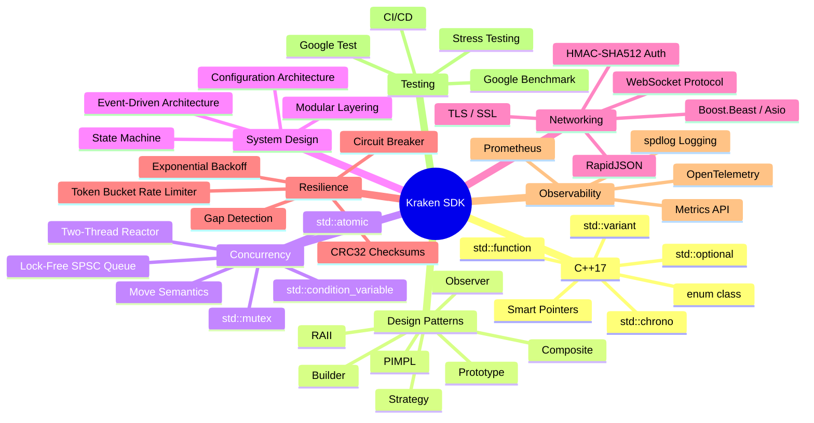

# 📚 Kraken SDK — Learning Guide

> **Master every concept behind this production-grade C++ SDK.**
> Each chapter explains a concept domain with theory, Mermaid diagrams, and direct references to the source code so you can see exactly where and how things are implemented.

---

## 🗺️ Concept Map

---

## 📖 Chapters

| # | Chapter | What You'll Learn |
|---|---------|-------------------|
| 1 | [C++17 Features](01_CPP17_FEATURES.md) | `std::variant`, `std::optional`, smart pointers, `std::chrono`, scoped enums, modern class idioms |
| 2 | [Design Patterns](02_DESIGN_PATTERNS.md) | PIMPL, Builder, Strategy, Observer, Composite, Prototype, RAII — all with class diagrams |
| 3 | [Concurrency](03_CONCURRENCY.md) | Two-thread reactor, SPSC queues, atomics, mutexes, condition variables, thread safety |
| 4 | [System Design](04_SYSTEM_DESIGN.md) | Architecture, data flow, state machines, configuration layers, subscription lifecycle |
| 5 | [Networking](05_NETWORKING.md) | WebSocket protocol, Boost.Beast, TLS, RapidJSON, authentication, Kraken API format |
| 6 | [Resilience](06_RESILIENCE.md) | Circuit breaker, exponential backoff, rate limiting, CRC32, gap detection |
| 7 | [Observability](07_OBSERVABILITY.md) | Structured logging, OpenTelemetry, Prometheus, metrics API, dashboards |
| 8 | [Testing](08_TESTING.md) | Google Test, benchmarks, stress testing, static analysis, CI/CD |

---

## 🧭 Suggested Reading Order

**Beginner** → Start with chapters 1 → 2 → 4 (language → patterns → architecture)

**Intermediate** → Add chapters 3 → 5 → 6 (concurrency → networking → resilience)

**Advanced** → Complete with 7 → 8 (observability → testing methodology)

---

## 📁 Source Code References

Throughout these documents, source code links use the format:
- `include/kraken/...` — Public API headers (what users see)
- `src/...` — Implementation files (what's behind the PIMPL wall)
- `src/internal/...` — Private headers shared between implementation files
- `tests/...` — Test suites
- `benchmarks/...` — Performance benchmarks

All paths are relative to the project root (`kraken-sdk/`).
